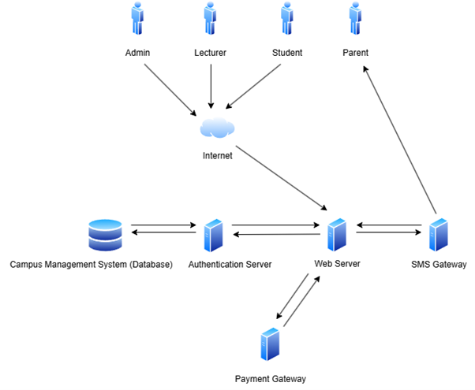
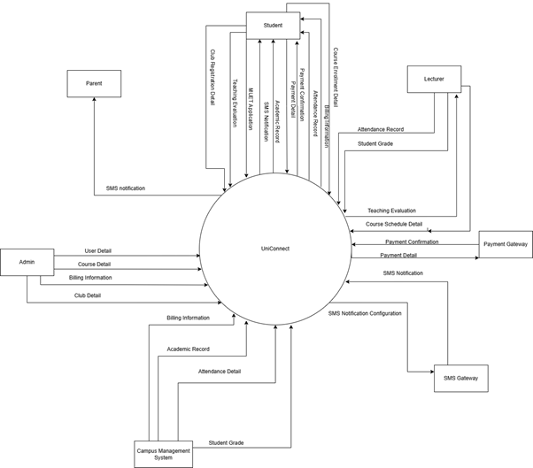
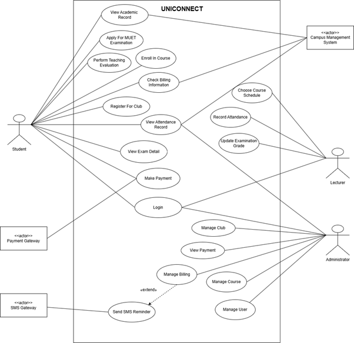

## Table of Contents

- [1. Introduction](#1-introduction)
  - [1.1 Purpose](#11-purpose)
  - [1.2 Scope](#12-scope)
  - [1.3 Product Overview](#13-product-overview)
    - [1.3.1 Product Perspectives](#131-product-perspectives)
      - [1.3.1.1 System Interfaces](#1311-system-interfaces)
      - [1.3.1.2 User Interfaces](#1312-user-interfaces)
      - [1.3.1.3 Hardware Interfaces](#1313-hardware-interfaces)
      - [1.3.1.4 Software Interfaces](#1314-software-interfaces)
      - [1.3.1.5 Communications Interfaces](#1315-communications-interfaces)
      - [1.3.1.6 Memory Constraints](#1316-memory-constraints)
      - [1.3.1.7 Operations](#1317-operations)
        - [1.3.1.7.1 Student Operations](#13171-student-operations)
        - [1.3.1.7.2 Lecturer Operations](#13172-lecturer-operations)
        - [1.3.1.7.3 Parent Operations](#13173-parent-operations)
        - [1.3.1.7.4 Admin Operations](#13174-admin-operations)
        - [1.3.1.7.5 Special Operations](#13175-special-operations)
      - [1.3.1.8 Site Adaptation Requirements](#1318-site-adaptation-requirements)
      - [1.3.1.9 Interface with Services](#1319-interface-with-services)
    - [1.3.2 Product Functions](#132-product-functions)
      - [1.3.2.1 User Login](#1321-user-login)
      - [1.3.2.2 Student](#1322-student)
      - [1.3.2.3 Lecturer](#1323-lecturer)
      - [1.3.2.4 Administrator](#1324-administrator)
    - [1.3.3 User Characteristics](#133-user-characteristics)
    - [1.3.4 Limitations](#134-limitations)
    - [1.3.5 Apportioning of Requirements](#135-apportioning-of-requirements)
  - [1.4 Definitions](#14-definitions)
- [2. References](#2-references)
- [3. Requirements](#3-requirements)
  - [3.1 External Interfaces](#31-external-interfaces)
  - [3.2 Functions](#32-functions)
  - [3.3 Functional Requirements](#33-functional-requirements)
  - [3.4 Performance Requirements](#34-performance-requirements)
  - [3.5 Usability Requirements](#35-usability-requirements)
  - [3.6 Interface Requirements](#36-interface-requirements)
  - [3.7 Logical Database Requirements](#37-logical-database-requirements)
  - [3.8 Design Constraints](#38-design-constraints)
  - [3.9 Standard Compliance](#39-standard-compliance)
  - [3.10 Software System Attributes](#310-software-system-attributes)
  - [3.11 Supporting Information](#311-supporting-information)
- [4. Verification Approach](#4-verification-approach)
- [5. Appendices](#5-appendices)

# 1 Introduction

## 1.1 Purpose

The purpose of **UniConnect: University Communication and Services Portal with Campus Management System and SMS Gateway Integration** is to:

1. **Centralize Academic/Administrative Services**  
   - Provide a unified digital platform for students, lecturers, administrators, and parents to access essential services (attendance, grades, billing) in real time.
2. **Enhance Communication**  
   - Bridge information gaps through automated SMS alerts for critical updates (e.g., low attendance, fee deadlines, academic progress).
3. **Streamline University Operations**  
   - Reduce manual workflows by integrating with the existing Campus Management System (CMS) for seamless data retrieval (no duplication of core functions).
4. **Improve Stakeholder Engagement**  
   - Empower parents with timely notifications to stay involved in their child’s education.
   - Enable lecturers and administrators to manage academic processes (attendance, grading) efficiently.

> The purpose of UniConnect is to automate and centralize university communication and services, providing stakeholders with real-time access to academic records, attendance data, and billing information while ensuring critical updates are delivered via SMS, thereby improving transparency and operational efficiency.

---

## 1.2 Scope

The software product to be developed is the **University Communication and Services Portal (UCSP)**, which will integrate with the existing Campus Management System (CMS) and an SMS Gateway Service.

The UCSP will provide a centralized digital platform for facilitating real-time, transparent communication and seamless access to academic and administrative services. The portal will retrieve essential student-related data—such as academic performance, attendance, class schedules, and billing details—from the existing CMS and present it through an intuitive, role-based user interface. In addition, the system will send automated SMS notifications to students and parents to alert them about critical updates like low attendance, upcoming fee payment deadlines, and academic performance summaries.

The UCSP will serve students, lecturers, university administrators, and parents by improving information flow, enhancing engagement, and increasing accountability. The system aims to reduce communication delays, minimize manual data handling, and ensure that all stakeholders are well-informed. Key benefits include improved academic monitoring, enhanced parent involvement, streamlined administrative processes, and quicker response to academic or financial issues.

This software scope aligns with institutional goals of promoting digital transformation in academic service delivery and is consistent with higher-level requirements to modernize campus communication, improve operational efficiency, and ensure proactive stakeholder engagement through timely data access and alerts.

### 1. Centralized Digital Platform

- **Purpose:** A single portal for students, lecturers and admins to access academic/administrative services.
- **Features:**
  - Unified login with role-based access (student, lecturer, admin).
  - Mobile-friendly design for cross-device accessibility.

### 2. Integration with Campus Management System

- **Data Sync:** Pulls and displays real-time data from existing systems  
- **Key Integrations:**
  - Student academic performance (GPA, course progress).
  - Class attendance records (QR-code scanning).
  - Billing details (payment history, due fees).

### 3. SMS Gateway for Notifications

- **Alerts Sent via SMS:**
  - Low attendance warnings (<80%) to parents/students.
  - Fee payment reminders.
  - Grade updates (e.g., MUET results).

### 4. Attendance Management

- **QR-Code Scanning:** Students scan attendance via QR codes in class.
- **Parent Alerts:** Automated SMS if attendance drops below threshold.

### 5. Academic Performance Tracking

- **Automated GPA Calculator:** Updates dynamically with new grades.
- **Course Completion Tracker:** Progress showing completed/pending courses.
- **Teaching Feedback:** Students evaluate lecturers qualitatively.

### 6. Billing & Payments

- **Records:** Full payment history.
- **Auto-Reminders:** Scheduled SMS for overdue fees.

### 7. Role-Based Dashboards

- **Students:** View grades, attendance, billing, club registrations.
- **Lecturers:** Input grades, manage attendance.
- **Admins:** send notifications, fees, and system settings.
- **Parent:** Receive students’ notification about attendance and fee reminder.

### 8. Document Management

- **UploadHub:**
  - Fee structures.
  - Club registration

### 9. MUET & Club Services

- **MUET:** Register for exams + view results on the portal.
- **Clubs:** Students join from extracurricular activities.

---

## 1.3 Product Overview

**UniConnect** is a centralized platform designed to enhance administrative and academic processes within the university. It allows students to manage course enrollments, club memberships, MUET applications, and receive SMS notifications regarding examinations and billing. Lecturers can manage course schedules, view academic records, and receive teaching evaluations, while administrators oversee club registrations, billing, and overall system configurations.

The system integrates with several external and internal services:

- **Campus Management System (Database):** Stores and retrieves student, academic, and billing data.
- **Authentication Server:** Handles secure login and access control for all users.
- **Web Server:** Manages user interfaces and system operations.
- **SMS Gateway:** Sends automated notifications to students and parents regarding important events (e.g., exams, payments).
- **Payment Gateway:** Handles fee transactions.

This integration ensures seamless data sharing, reduces administrative workload, and enhances communication between students, faculty, and administration.

> The following diagram illustrates the architecture and key components of UniConnect.

## 1.3.1 Product Perspectives

The following diagram illustrates the system's context diagram, depicting the interactions between system components and external actors.

**Figure 1.1: System Overview Diagram**

**Figure 1.2: System Context Diagram**

---

### 1.3.1.1 System Interfaces

UniConnect is an integrated digital platform designed to streamline academic communication and service delivery within the university. It interacts with multiple external systems and hardware interfaces to provide comprehensive functionality to students, lecturers, and administrators.

- UniConnect integrates with the university's Authentication System (LDAP) to manage secure user login and role-based access for students, lecturers, and administrators.
- The system connects with the Student Information System (SIS) to retrieve and manage academic records, course enrollments, and student profiles.
- For payment and finance features, UniConnect integrates with external payment gateways to facilitate tuition fee payments and club registration fees, allowing students to upload payment receipts for verification.
- The system is integrated with an SMS Gateway to automate notifications for payment reminders and low attendance alerts, which are sent to both students and their parents.
- Attendance functionality utilizes QR code scanning via student devices and generates QR codes through the lecturer interface for real-time class attendance tracking.

These integrations ensure that UniConnect provides a seamless and responsive experience while leveraging existing institutional infrastructure and external services.

---

### 1.3.1.2 User Interfaces

The UniConnect Portal features a web-based user interface designed to support seamless communication, academic service access, and administrative functions within the university ecosystem. The interface provides role-specific dashboards for Students, Lecturers, and Administrators, ensuring that users interact only with features relevant to their responsibilities.

- The system integrates logically with core institutional services such as the Course Enrollment System, Student Finance Database, MUET Result Repository, and the SMS Gateway for notification delivery.
- This integration allows users to access real-time data, such as course registration updates, GPA calculations, attendance summaries, and financial transactions, all from a unified and intuitive dashboard.

**Each interface emphasizes:**
- **Clarity:** Consistent layout and labeled buttons.
- **Responsiveness:** Supporting desktops, tablets, and mobile devices.
- **Efficiency:** Reducing the number of clicks needed to perform actions such as submitting excuses, reviewing attendance, or downloading billing receipts.

Navigation menus, status indicators, and alerts are placed prominently for easy access. Whether it is a student uploading a payment receipt, a lecturer updating grades, or an admin managing course schedules, each user experiences a streamlined and focused interface customized to their role.

The UniConnect UI not only improves user experience within the portal but also enhances coordination across various campus departments by centralizing interactions through a cohesive digital environment.

---

### 1.3.1.3 Hardware Interfaces

The UniConnect system operates as a web-based university communication and services portal that interfaces with multiple hardware platforms to deliver its functionality across student, lecturer, parent, and admin roles. It is designed to run on a wide range of user devices and backend infrastructure while supporting both traditional and modern hardware technologies.

- The system supports interaction through smartphones, tablets, desktops, and laptops, allowing users to access features such as QR code attendance scanning, receipt uploads, academic management, and club registration.
- For attendance tracking, UniConnect integrates with mobile and external webcams to scan QR codes using device cameras.
- The system interfaces with external SMS gateway hardware (via GSM/4G modems or cloud APIs) to enable automatic delivery of fee reminders and attendance alerts.
- Server-side, the system requires stable backend hardware capable of running a web and database server environment, ensuring scalability and performance for multiple concurrent users.

This multi-platform hardware integration ensures that the UniConnect portal remains accessible, responsive, and functional regardless of the user's device or location, while also enabling hardware-assisted services such as QR scanning and SMS-based notifications.

---

### 1.3.1.4 Software Interfaces

UniConnect is designed to operate seamlessly across web and mobile platforms, integrating with various software components and third-party services to deliver a unified campus experience. The system interfaces with internal databases and APIs for academic records, finance, and attendance, while also utilizing third-party software for SMS gateway services, QR code processing, and real-time notifications.

- UniConnect supports cross-platform access through Android and iOS mobile operating systems, ensuring students, lecturers, and administrators can engage with the platform using smartphones or tablets.
- It is also compatible with modern web browsers on Windows and Linux environments.

**The system integrates with:**
- A QR Code Scanning API to support attendance tracking via mobile devices.
- An SMS Gateway API to automatically send reminders and alerts for attendance, finance, and academic updates.
- A Relational Database Management System (MySQL) for secure and efficient data handling.
- A Web Server (Apache) and PHP-based backend framework for dynamic data interaction.
- Local Authentication Systems and role-based access control to secure sensitive academic and financial data.

Each of these software components is essential for UniConnect’s operation, supporting functions such as academic tracking, course enrollment, club registration, billing updates, and real-time communication between students, lecturers, and administrators.

---

### 1.3.1.5 Communications Interfaces

UniConnect is a centralized web-based university communication and services portal that integrates with various communication channels to support seamless interaction among students, lecturers, and administrators. The system communicates with end-user devices over the internet using secure HTTP/HTTPS protocols, enabling access to features such as QR code attendance, academic records, club registration, and financial tracking.

- UniConnect also integrates with external systems such as SMS gateways—either through GSM modems using AT commands or cloud-based APIs—to deliver real-time alerts like fee reminders and attendance warnings to students and parents.
- Internally, the system ensures robust data flow through TCP/IP-based communication between its application and database servers.
- Additional communication methods include browser-based processing for QR scanning and secure file uploads.

This integration of standard web and network protocols ensures that UniConnect remains interoperable, secure, and scalable while maintaining effective communication between users, the server infrastructure, and external notification systems.

### 1.3.1.6 Memory Constraints

UniConnect is a comprehensive University Communication and Services Portal designed to integrate seamlessly with existing campus management systems, SMS gateway services, and academic record databases. The system supports various actors including students, lecturers, and administrators by providing functionalities such as attendance tracking, academic performance management, club registration, and financial transactions.

To ensure smooth operation and high performance across these integrated components, UniConnect imposes specific memory constraints on both server and client environments. These constraints help manage the primary and secondary memory usage efficiently, enabling fast data processing, real-time notifications, and reliable storage of user data and session information. By adhering to these memory limits, UniConnect guarantees optimal performance, resource utilization, and scalability in a multi-user academic environment.

| Constraint ID | Description | Author |
|:------------- |:----------- |:-------|
| REQ_MC_001 | The web server hosting UniConnect must have sufficient RAM (minimum 8GB recommended) to handle multiple concurrent user sessions smoothly without performance degradation. | Foo Yau Yun |
| REQ_MC_002 | The database server requires adequate memory to cache frequently accessed data (minimum 8GB recommended) for fast query responses related to academic records, attendance, and user data. | Foo Yau Yun |
| REQ_MC_003 | Client devices (smartphones, tablets, desktops) must have enough RAM to run modern browsers efficiently to support features like QR code scanning and real-time notifications. Minimum 2GB RAM recommended. | Foo Yau Yun |
| REQ_MC_004 | Uploaded files such as payment receipts and QR code images should be stored efficiently in secondary storage with a maximum individual file size limit of 5MB to ensure quick upload/download and avoid excessive disk usage. | Foo Yau Yun |
| REQ_MC_005 | Temporary session data (such as user login tokens, scanned QR data) should be kept in memory with automatic expiration after inactivity of 30 minutes to optimize server memory usage. | Foo Yau Yun |
| REQ_MC_006 | The system’s caching mechanism for SMS gateway message logs and notifications should limit memory usage to prevent overflow, retaining only the last 30 days of records in primary memory before archiving to secondary storage. | Foo Yau Yun |

**Table 1.3.1.6 Memory Constraints**

### 1.3.1.7 Operations

This section outlines the operational functionalities of UniConnect. The system is designed to serve multiple user roles—Students, Lecturers, Admins, and Parents—each with specific access rights and tasks based on their responsibilities within the academic institution.

The operations described herein cover user authentication, academic record access, attendance tracking, course and financial management, communication via SMS alerts, and system-wide automation. All functionalities are accessible through a secure, role-based web and mobile interface, supported by centralized authentication and data synchronization mechanisms.

The operations are grouped into five main categories:
- **Student Operations:** Includes login, course enrollment, GPA and attendance tracking, club participation, tuition payment, and alert management.
- **Lecturer Operations:** Covers course schedule management, attendance handling via QR codes and manual override, student grading, and access to teaching evaluation results.
- **Admin Operations:** Encompasses full system management including user control, course and timetable configuration, club management, payment verification, SMS alert setup, and institutional reporting.
- **Parent Operations:** Provides passive access through SMS alerts for key student-related events such as low attendance or unpaid fees.
- **Special Operations:** Details the underlying infrastructure processes like authentication integration, SMS gateway handling, automated GPA and attendance calculations, offline data synchronization, and scheduled backup/recovery procedures.

Each operational group ensures that system users interact with the portal in a secure, efficient, and role-specific manner, enabling streamlined communication, real-time academic tracking, and effective administrative management.

#### 1.3.1.7.1 Student Operations

1. **User Authentication (Login)**
   - Students securely log in using their student ID and password via web or mobile portals.
   - Authentication is managed by a centralized server using encrypted credentials.
   - Role-based dashboard access is granted upon successful login.

2. **View Academic Records**
   - Students access current and past academic performance:
     - Enrolled course list
     - Grades and final results
     - GPA/CGPA calculated automatically
     - MUET application status and results

3. **Course Enrollment and Evaluation Submission**
   - Students enroll in available semester courses.
   - The system displays only courses they are eligible to enroll in.
   - Students submit teaching evaluations anonymously for each lecturer.

4. **Attendance Monitoring**
   - Students can view:
     - Subject-wise attendance percentage
     - Lecture-wise attendance breakdown
   - Attendance <80% triggers a system alert and SMS warning to student and parent.

5. **QR Code Attendance Scanning**
   - During each lecture, students scan a unique QR code generated by the lecturer.
   - Student ID and timestamp are verified before marking attendance.
   - Offline scans are queued and synced once internet is available.

6. **Club Registration and Participation**
   - Students browse and register for available clubs.
   - Payment receipts for club fees are uploaded.
   - Participation records are updated for administrative and academic tracking.

7. **View and Pay Tuition Fees**
   - The finance section displays outstanding bills and payment history.
   - Students upload proof of bank transfer/payment receipt.
   - Admins verify payments, and downloadable receipts are generated upon approval.

8. **View Notifications and Alerts**
   - Students receive:
     - Academic updates (grades, exam schedules)
     - Finance alerts (unpaid fees)
     - Attendance warnings
   - Alerts are shown in the dashboard and sent via SMS gateway.

---

#### 1.3.1.7.2 Lecturer Operations

1. **Lecturer Authentication (Login)**
   - Lecturers log in via secure lecturer portal using their credentials.
   - Access is validated by centralized authentication and is role-restricted.

2. **Course Schedule and Class Access**
   - Lecturers view assigned courses and their weekly class schedules.
   - Courses are linked to student rosters and attendance records.

3. **Generate QR Codes for Attendance**
   - System generates unique QR codes per lecture session.
   - QR codes can be displayed on screen or printed for student scanning.

4. **Manual Attendance Override**
   - Lecturers can manually mark attendance for students unable to scan the code.
   - Manual entries are logged for administrative auditing.

5. **Record and Update Student Grades**
   - Lecturers input:
     - Internal marks
     - Midterm and final exam scores
     - Overall grade
   - System auto-updates student academic records and GPA calculations.

6. **View Teaching Evaluation Results**
   - Lecturers access anonymized teaching feedback submitted by students.
   - Evaluation metrics help improve course delivery and instructional quality.

---

#### 1.3.1.7.3 Parent Operations

1. **Receive SMS Notifications**
   - Linked mobile numbers receive alerts when:
     - Student attendance drops below 80%
     - Tuition or club fees overdue

2. **No Login Required**
   - Parents are passive users; they do not require access to system dashboards.

3. **Escalation Alerts (Special Cases)**
   - Repeated low attendance or non-payment triggers high-priority SMS alerts to parents.
   - Alerts include student details and required action.

---

#### 1.3.1.7.4 Admin Operations

1. **Admin Authentication (Login)**
   - Admin log in via secure admin portal using their credentials.
   - System ensures role-based access to various modules.

2. **User Management (Students, Lecturers, Parents)**
   - Admins can:
     - Create, modify, or delete user accounts
     - Assign roles and permissions

3. **Course and Schedule Management**
   - Admins manage:
     - Course creation, editing, and deletion
     - Lecturer assignments
   - Schedule updates reflect in student and lecturer dashboards.

4. **Finance and Payment Verification**
   - Admins view and verify uploaded tuition/club payment receipts.

5. **Automated SMS Alert Configuration**
   - Admins configure templates and thresholds for:
     - Attendance warnings
     - Fee reminders

6. **Attendance and Academic Reports**
   - Admins generate reports including:
     - Attendance trends per class/course
     - Grade distributions per semester
     - Course enrollment summaries
     - Payment and dues tracking

7. **Document Management**
   - Admins upload/download institutional documents:
     - Academic calendar
     - Forms (e.g., MUET)
   - Accessible to students and lecturers from their dashboards.

---

#### 1.3.1.7.5 Special Operations

1. **Authentication Integration**
   - All users are authenticated via a unified login API.
   - Brute-force protection and session timeout mechanisms are enabled.
   - Failed attempts are logged and optionally notified to admins.

2. **SMS Gateway Integration**
   - Integrated SMS gateway delivers real-time alerts:
     - Attendance issues
     - Payment deadlines
     - Announcements
   - Delivery receipts and failures are tracked in the backend.

3. **Auto GPA & Attendance Calculation**
   - System auto-calculates GPA/CGPA on grade submissions.
   - Daily attendance percentage is recalculated and stored.
   - Threshold triggers send alerts as needed.

4. **Unattended Data Sync**
   - Offline actions (e.g., QR scan without network) are cached.
   - Once connection resumes, sync is performed securely with a timestamp.

5. **Scheduled Backups and Recovery**
   - System performs daily backups of:
     - User accounts
     - Attendance data
     - Grade/academic data
     - Financial transactions
   - Backups are stored locally and in the cloud (if configured).
   - Admin panel includes tools to restore from backup in case of failure.

---

### 1.3.1.8 Site Adaptation Requirements

UniConnect is a comprehensive, modular, and scalable university communication and services portal designed to streamline academic, administrative, and student support processes. As a multi-institutional platform, UniConnect is engineered with flexibility in mind to support varying operational modes, educational policies, infrastructural differences, and institutional configurations across diverse campus environments.

Site adaptation requirements refer to the specific configurations, data initializations, and system customizations necessary to tailor the software for deployment at a particular site or institution. These adaptations are critical to ensuring that the system behaves correctly and efficiently in different operational contexts and aligns with the unique business rules, policies, and technical environments of the host institution.

The UniConnect system supports the initialization and customization of:
- **Academic Structures:** Programmes, courses, semesters, academic calendars, credit structures, grading policies, and course codes, all of which may differ across universities or faculties.
- **Operational Rules:** Attendance policies (e.g., minimum percentage thresholds), MUET requirement policies, payment schedules, and automated notifications based on local compliance requirements or institutional regulations.
- **Administrative Workflows:** Processes such as course enrollment approval, teaching evaluation cycles, excuse submission and approval workflows, and academic performance calculations that may differ in sequence, roles involved, or conditions.
- **Integration Points:** API endpoints, data mapping, and authentication methods that allow integration with existing systems such as Student Information Systems (SIS), Learning Management Systems (LMS), Finance and Billing Systems, or Identity Access Management (IAM) systems used by the institution.
- **Localized Data:** Initialization of data such as department names, faculty assignments, building and room information for class scheduling, payment gateway credentials, notification templates, and SMS gateway configurations.
- **Currency and Time Settings:** Support for currency formats for billing modules, and time zones to ensure accurate scheduling and timestamping of academic and administrative events.

These site adaptation features are implemented through configuration files, database seeders, admin-controlled setup modules, and secure APIs to allow for easy customization without altering the core system logic. This approach ensures that UniConnect can be deployed across multiple campuses or institutions with minimal reengineering, while still meeting specific operational needs and regulatory requirements.

By supporting detailed and modular site adaptation, UniConnect offers a robust foundation for academic institutions to implement a centralized yet flexible system that fully aligns with their internal structures, policies, and strategic goals.

**Table 1.3.1.8 Site Adaptation Requirements**

| Constraint ID  | Type               | Description                                                                                                                                                 | Author        |
|:-------------- |:------------------ |:----------------------------------------------------------------------------------------------------------------------------------------------------------- |:------------- |
| REQ_SAR_001    | Data Initialization| User authentication data (ID and password format) must be adapted to match the university's user ID conventions.                                            | Foo Yau Yun   |
| REQ_SAR_002    | Data Initialization| Course and subject codes need to be configured according to the university's course catalog and academic calendar.                                          | Foo Yau Yun   |
| REQ_SAR_003    | Data Initialization| Club information and registration fees must be customized to the specific clubs available and their fees per site.                                          | Foo Yau Yun   |
| REQ_SAR_004    | Data Initialization| MUET test sessions and application deadlines should be set based on the local MUET schedule and university policies.                                        | Foo Yau Yun   |
| REQ_SAR_005    | Data Initialization| Payment methods (e.g., Mastercard, online transfer) and receipt upload formats must match the financial system used.                                        | Foo Yau Yun   |
| REQ_SAR_006    | Feature Adaptation | Notification content and triggers (e.g., low attendance alerts, fee reminders) must be aligned with university policies.                                    | Foo Yau Yun   |
| REQ_SAR_007    | Feature Adaptation | Attendance scanning methods (QR code generation and scanning) should be adapted to the campus infrastructure.                                               | Foo Yau Yun   |
| REQ_SAR_008    | Feature Adaptation | SMS gateway integration settings, including message formats and recipient contact lists (students, parents), must be configured per site.                   | Foo Yau Yun   |
| REQ_SAR_009    | Feature Adaptation | Lecturer course scheduling options must reflect the specific timetable and class sectioning policies of the university.                                     | Foo Yau Yun   |
| REQ_SAR_010    | Feature Adaptation | User roles and categories (e.g., foundation/diploma, degree, lecturer) must be defined according to university hierarchy.                                  | Foo Yau Yun   |
| REQ_SAR_011    | Feature Adaptation | Academic evaluation forms (teaching evaluation) should be customizable to the university’s evaluation criteria and question sets.                          | Foo Yau Yun   |
| REQ_SAR_012    | Feature Adaptation | Financial account activity and payment history tables should integrate with the local financial record-keeping system.                                      | Foo Yau Yun   |
| REQ_SAR_013    | Data Initialization| GPA and CGPA calculation formulas should follow the university's grading system and trimester calendar.                                                    | Foo Yau Yun   |
| REQ_SAR_014    | Feature Adaptation | Admin dashboard controls (user management, course management) should match the administrative workflows of the site.                                       | Foo Yau Yun   |
| REQ_SAR_015    | Feature Adaptation | SMS reminder scheduling and sending intervals should conform to university communication policies and timing.                                               | Foo Yau Yun   |

---

### 1.3.1.9 Interface with Services

The UniConnect Portal integrates with various cloud-based and internal services to support its core functionalities for students, lecturers, and administrators. The system is designed to operate in synergy with both third-party services (e.g., SMS gateway, payment gateway, QR scanning APIs) and internal university modules (e.g., GPA calculator, attendance tracker) to provide a seamless experience.

For instance, the system uses a QR Code Scanner API for real-time attendance recording, which is linked to an Attendance Monitoring Engine that triggers alerts and updates records in the Cloud Database. Additionally, the SMS Gateway is used to send automated notifications such as low attendance warnings and payment reminders.

To ensure secure access and user authentication, the system interfaces with a cloud-based authentication service. Financial transactions, such as tuition and club fee payments, are handled through a payment gateway integration, and student academic data is stored and retrieved using a cloud storage and database service.

These service interfaces ensure that UniConnect remains highly responsive, secure, and integrated within the university’s digital ecosystem, promoting efficient academic and administrative operations.

**Table 1.3.1.9 Interfaces With Services**

| Interface ID     | Service Name                 | Description                                                                                                                                                  | Author        |
|:---------------- |:----------------------------|:-------------------------------------------------------------------------------------------------------------------------------------------------------------|:------------- |
| REQ_IWS_001      | Authentication Service       | Cloud-based authentication service used to verify user credentials (ID and password) during login.                                                           | Foo Yau Yun   |
| REQ_IWS_002      | QR Code Scanner API          | Integrated API (e.g., ZXing, Dynamsoft) for scanning QR codes used in student attendance and club registration payment.                                      | Foo Yau Yun   |
| REQ_IWS_003      | SMS Gateway                 | SMS service providers (e.g., Twilio, Nexmo, SMS API from local telco) used to send automated reminders for low attendance and overdue payments.              | Foo Yau Yun   |
| REQ_IWS_004      | Cloud Database Service       | Centralized cloud database (e.g., Firebase Firestore, AWS RDS, MySQL on Azure) storing all user, course, attendance, payment, and academic records.          | Foo Yau Yun   |
| REQ_IWS_005      | Cloud Storage Service        | Cloud file storage service (e.g., AWS S3, Firebase Storage) used to store uploaded documents such as MUET receipts, payment receipts, and registration proof.| Foo Yau Yun   |
| REQ_IWS_006      | GPA Calculation Service      | Internal microservice or integrated backend logic that calculates GPA and CGPA using stored academic grades.                                                 | Foo Yau Yun   |
| REQ_IWS_007      | Teaching Evaluation Module   | Internal service that enables evaluation of lecturers based on predefined criteria and stores evaluation results in the cloud.                               | Foo Yau Yun   |
| REQ_IWS_008      | Payment Gateway Integration  | Third-party service (e.g., Stripe, PayPal, iPay88) to process student tuition and club registration payments securely.                                       | Foo Yau Yun   |
| REQ_IWS_009      | Course Enrollment System     | Backend service allows real-time course and section registration based on eligibility and seat availability.                                                 | Foo Yau Yun   |
| REQ_IWS_010      | Notification Service         | Cloud messaging service (e.g., Firebase Cloud Messaging) for pushing alerts to student dashboards (e.g., attendance alerts, fee reminders).                  | Foo Yau Yun   |
| REQ_IWS_011      | User Role Management Service | Admin tool/module managing access control for students, lecturers, and admins via cloud-based permissions framework.                                         | Foo Yau Yun   |
| REQ_IWS_012      | Attendance Monitoring Engine | Service to aggregate and analyze attendance records and generate reports, including identifying students below threshold.                                    | Foo Yau Yun   |
| REQ_IWS_013      | Club Management Module       | Internal service managing club lists, registrations, and participation data, integrated with QR and storage services.                                        | Foo Yau Yun   |
| REQ_IWS_014      | Academic Records Viewer      | Cloud service/module fetching and displaying subjects, grades, coursework, and final exam details for enrolled students.                                     | Foo Yau Yun   |

---

### 1.3.2 Product Functions

**Figure 1.3: Use Case Diagram of UniConnect**

---

#### 1.3.2.1 User Login

| Use Case ID   | Use Case Name | Description                                                                 |
|:------------- |:------------- |:----------------------------------------------------------------------------|
| REQ_UCU001    | Login         | Allows users (Student, Lecturer, Administrator) to log into the portal using valid credentials. |

**Table 1.3.2.1: Use Case of User Login**

---

#### 1.3.2.2 Student

| Use Case ID    | Use Case Name           | Description                                                         |
|:-------------- |:----------------------- |:--------------------------------------------------------------------|
| REQ_UCS_001    | View Academic Record    | Enables student to view grades, GPA, and academic progress.         |
| REQ_UCS_002    | Apply For MUET Exam    | Enables student to apply for MUET by submitting required details.   |
| REQ_UCS_003    | Perform Teaching Evaluation | Allows student to perform teaching evaluations for their lecturer and tutors. |
| REQ_UCS_004    | Enroll In Course       | Allows student to enroll in courses with schedule and availability checks. |
| REQ_UCS_005    | Check Billing Information | Enables student to view tuition fees, balances, and payment history. |
| REQ_UCS_006    | Register For Club      | Permits student to register for clubs available during the open period. |
| REQ_UCS_007    | View Attendance Record | Allows student to check attendance status for enrolled courses.      |
| REQ_UCS_008    | View Exam Details      | Allows student to view exam schedule including date, time, and venue.|
| REQ_UCS_009    | Make Payment           | Allows student to make online payments for tuition and other fees.   |

**Table 1.3.2.2: Use Case of Student**

---

#### 1.3.2.3 Lecturer

| Use Case ID    | Use Case Name           | Description                                                    |
|:-------------- |:----------------------- |:--------------------------------------------------------------|
| REQ_UCL_001    | Choose Course Schedule  | Permits lecturer to select or modify the course schedule.      |
| REQ_UCL_002    | Record Attendance       | Enables lecturers to mark and record student attendance.       |
| REQ_UCL_003    | Update Grade            | Allows the lecturer to input and update students’ grades.      |

**Table 1.3.2.3: Use Case of Lecturer**

---

#### 1.3.2.4 Administrator

| Use Case ID    | Use Case Name           | Description                                                    |
|:-------------- |:----------------------- |:--------------------------------------------------------------|
| REQ_UCA_001    | Manage Club             | Enables the administrator to approve, update, or remove student clubs. |
| REQ_UCA_002    | View Payment            | Allows the administrator to view records of student payments and transactions. |
| REQ_UCA_003    | Manage Billing          | Enables the administrator to configure and monitor billing and payment details. |
| REQ_UCA_004    | Manage User             | Enables the administrator to create, update, or delete user accounts.  |
| REQ_UCA_005    | Manage Course           | Allows the administrator to manage course offerings and structure.    |
| REQ_UCA_006    | View Attendance Record  | Allows the administrator to access and review student attendance data. |

**Table 1.3.2.4: Use Case of Administrator**

---

### 1.3.3 User Characteristics

This section describes the end users of the University Communication and Services Portal and their expected level of system knowledge. The following table outlines the characteristics for each user role.

| Role         | Description                                                               | Expected Knowledge                                                           |
|:------------ |:------------------------------------------------------------------------- |:-----------------------------------------------------------------------------|
| Student      | Individuals enrolled in academic programs at the university.              | Familiarity with accessing academic records, attendance, course registration, and notifications. |
| Lecturer     | Academic staff responsible for teaching and academic management.          | Moderate understanding of class management, attendance submission, and grading tools. |
| Parent       | Guardians of students who are granted access to student performance updates. | Basic ability to receive and interpret notifications related to academic progress and attendance. |
| Administrator| Staff managing the portal and system operations across departments.       | Proficient in user management, content control, system configuration, and data oversight. |

**Table 1.3.3: User Characteristics**

---

### 1.3.4 Limitations

The UniConnect platform, while designed to centralize academic and administrative services, faces several limitations that may affect its performance, scalability, and integration potential:

1. **Dependency on Internet Connectivity**  
   - The platform is fully web-based and requires constant internet access. Offline functionality is not supported, which may impact users in areas with limited or unstable internet access.

2. **Limited Integration with External Systems**  
   - The platform does not support integration with third-party Learning Management Systems (LMS) such as Moodle or Google Classroom, nor does it provide public APIs for external developers, reducing extensibility.

3. **SMS Gateway Reliability**  
   - Automated notifications via SMS are dependent on the reliability of the third-party SMS gateway. Any service outage or delay from the SMS provider may result in failed or delayed message delivery.

4. **Lack of Mobile App Support**  
   - UniConnect is accessible only through a mobile-responsive browser version. Native mobile applications for Android or iOS are not included in the current scope.

5. **No Payment Gateway Integration**  
   - While the system provides billing details and reminders, it does not support real-time payment processing. Users must complete payments via external methods.

---

### 1.3.5 Apportioning of Requirements

The apportioning of requirements of the University Communication and Services Portal are described below:

| Module Name                  | Description                                                                                      |
|:---------------------------- |:-----------------------------------------------------------------------------------------------|
| User Authentication          | Manages login credentials and session access for students, lecturers, parents, and administrators. |
| Academic Information Module  | Handles access to academic records, grades, exam schedules, and updates.                        |
| Attendance Tracking          | Tracks and displays attendance data; triggers low attendance alerts.                             |
| Billing & Payment Module     | Displays billing information and sends automated fee reminders to students.                      |
| Course Management            | Facilitates course enrollment and updates course data via Campus Management System.              |
| Club Registration            | Allows students to register for clubs, track availability, and confirm participation.            |
| MUET Application             | Supports MUET exam registration and submission of relevant exam details.                         |
| Notification & SMS Gateway   | Sends system-generated notifications and SMS alerts via the integrated SMS Gateway.              |
| Administrative Dashboard     | Provides system admins with tools to manage users, content, academic data, and platform settings.|

**Table 1.3.5: Apportioning of Requirements**

---

### 1.4 Definitions

Below are the terms, phrases, and words used in the document and their related definitions:

| Terms                              | Definition                                                                                                  |
|:----------------------------------- |:-----------------------------------------------------------------------------------------------------------|
| University Communication and Services Portal | A digital portal that centralizes student, lecturer, administrator, and parent access to university services and updates. |
| Campus Management System (CMS)      | An integrated system that manages academic operations such as course enrollment, attendance, exams, and academic records. |
| SMS Gateway                        | A system component that sends real-time alerts and updates to users via SMS, such as fee reminders and academic notifications. |
| Portal User                         | Any individual (student, lecturer, parent, or administrator) who interacts with the portal to access services and information. |
| Student                             | A person currently enrolled in the university, using the portal to manage academic, financial, and extracurricular activities. |
| Lecturer                            | Academic staff using the portal to manage classes, input grades, and monitor student performance.           |
| Parent                              | Guardians with limited access to student-related information such as academic performance, attendance, and alerts. |
| Administrator                       | Personnel responsible for configuring, maintaining, and overseeing operations within the portal and CMS systems. |
| Graphical User Interface (GUI)      | The visual interface that users interact with to navigate and operate the portal system.                    |
| End User                            | A general term describing any user accessing features or data through the portal.                           |

**Table 1.4: Definitions**

---

## 2. References

1. **IEEE. (2018).** ISO/IEC/IEEE 29148:2018 Systems and software engineering—Life cycle processes—Requirements engineering. [https://www.iso.org/standard/72089.html](https://www.iso.org/standard/72089.html)
2. **Pohl, K. (2010).** Requirements engineering: Fundamentals, principles, and techniques. Springer.
3. **Malaysia. (2010).** Personal Data Protection Act 2010 (Act 709). Commissioner of Law Revision, Malaysia. Retrieved from [https://www.pdp.gov.my/](https://www.pdp.gov.my/)
4. **PCI Security Standards Council. (2022).** Payment Card Industry Data Security Standard: Requirements and security assessment procedures (Version 4.0). [https://www.pcisecuritystandards.org/documents/PCI-DSS-v4_0.pdf](https://www.pcisecuritystandards.org/documents/PCI-DSS-v4_0.pdf)
5. **Malaysian Communications and Multimedia Commission. (n.d.).** Official portal. [https://www.mcmc.gov.my](https://www.mcmc.gov.my)
6. **Ministry of Higher Education Malaysia. (n.d.).** Official portal. [https://www.mohe.gov.my](https://www.mohe.gov.my)

---
