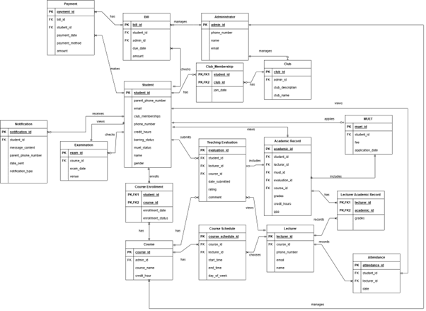

## Table of Contents

- [1. Introduction](#1-introduction)
  - [1.1 Purpose](#11-purpose)
  - [1.2 Scope](#12-scope)
  - [1.3 Product Overview](#13-product-overview)
    - [1.3.1 Product Perspectives](#131-product-perspectives)
      - [1.3.1.1 System Interfaces](#1311-system-interfaces)
      - [1.3.1.2 User Interfaces](#1312-user-interfaces)
      - [1.3.1.3 Hardware Interfaces](#1313-hardware-interfaces)
      - [1.3.1.4 Software Interfaces](#1314-software-interfaces)
      - [1.3.1.5 Communications Interfaces](#1315-communications-interfaces)
      - [1.3.1.6 Memory Constraints](#1316-memory-constraints)
      - [1.3.1.7 Operations](#1317-operations)
        - [1.3.1.7.1 Student Operations](#13171-student-operations)
        - [1.3.1.7.2 Lecturer Operations](#13172-lecturer-operations)
        - [1.3.1.7.3 Parent Operations](#13173-parent-operations)
        - [1.3.1.7.4 Admin Operations](#13174-admin-operations)
        - [1.3.1.7.5 Special Operations](#13175-special-operations)
      - [1.3.1.8 Site Adaptation Requirements](#1318-site-adaptation-requirements)
      - [1.3.1.9 Interface with Services](#1319-interface-with-services)
    - [1.3.2 Product Functions](#132-product-functions)
      - [1.3.2.1 User Login](#1321-user-login)
      - [1.3.2.2 Student](#1322-student)
      - [1.3.2.3 Lecturer](#1323-lecturer)
      - [1.3.2.4 Administrator](#1324-administrator)
    - [1.3.3 User Characteristics](#133-user-characteristics)
    - [1.3.4 Limitations](#134-limitations)
    - [1.3.5 Apportioning of Requirements](#135-apportioning-of-requirements)
  - [1.4 Definitions](#14-definitions)
- [2. References](#2-references)
- [3. Requirements](#3-requirements)
  - [3.1 External Interfaces](#31-external-interfaces)
    - [3.1.1 Login Page](#311-login-page)
    - [3.1.2 Student](#312-student)
      - [3.1.2.1 Academic Record](#3121-academic-record)
        - [3.1.2.1.1 Academic Update](#31211-academic-update)
        - [3.1.2.1.2 Course Enrollment](#31212-course-enrollment)
        - [3.1.2.1.3 GPA](#31213-gpa)
        - [3.1.2.1.4 MUET](#31214-muet)
        - [3.1.2.1.5 Teaching Evaluation](#31215-teaching-evaluation)
      - [3.1.2.2 Attendance Record](#3122-attendance-record)
      - [3.1.2.3 Club](#3123-club)
      - [3.1.2.4 Finance](#3124-finance)
      - [3.1.2.5 Scan Attendance](#3125-scan-attendance)
    - [3.1.3 Lecturer](#313-lecturer)
      - [3.1.3.1 Choose Schedule](#3131-choose-schedule)
      - [3.1.3.2 Record Attendance](#3132-record-attendance)
      - [3.1.3.3 Record Grades](#3133-record-grades)
    - [3.1.3 Admin](#313-admin)
      - [3.1.3.1 User Management](#3131-user-management)
      - [3.1.3.2 Course Management](#3132-course-management)
      - [3.1.3.3 Finance](#3133-finance)
      - [3.1.3.4 Attendance](#3134-attendance)
  - [3.2 Functions](#32-functions)
    - [3.2.1 Sequence Diagram](#321-sequence-diagram)
      - [3.2.1.1 User Login](#3211-user-login)
      - [3.2.1.2 Student](#3212-student)
        - [3.2.1.2.1 View Academic Record](#32121-view-academic-record)
        - [3.2.1.2.2 View Attendance Record](#32122-view-attendance-record)
        - [3.2.1.2.3 Check Billing Information](#32123-check-billing-information)
        - [3.2.1.2.4 Register For Club](#32124-register-for-club)
        - [3.2.1.2.5 Enroll In Course](#32125-enroll-in-course)
        - [3.2.1.2.6 Apply For MUET Examination](#32126-apply-for-muet-examination)
        - [3.2.1.2.7 View Exam Detail](#32127-view-exam-detail)
        - [3.2.1.2.8 Perform Teaching Evaluation](#32128-perform-teaching-evaluation)
        - [3.2.1.2.9 Make Payment](#32129-make-payment)
      - [3.2.1.3 Lecturer](#3213-lecturer)
        - [3.2.1.3.1 Choose Course Schedule](#32131-choose-course-schedule)
        - [3.2.1.3.2 Record Attendance](#32132-record-attendance)
        - [3.2.1.3.3 Update Result](#32133-update-result)
      - [3.2.1.3 Administrator](#3213-administrator)
        - [3.2.1.3.1 Manage User](#32131-manage-user)
        - [3.2.1.3.2 Manage Billing](#32132-manage-billing)
        - [3.2.1.3.3 Manage Club](#32133-manage-club)
        - [3.2.1.3.4 View Attendance Record](#32134-view-attendance-record)
        - [3.2.1.3.5 Manage Course](#32135-manage-course)
        - [3.2.1.3.6 View Payment](#32136-view-payment)
  - [3.3 Functional Requirements](#33-functional-requirements)
  - [3.4 Performance Requirements](#34-performance-requirements)
  - [3.5 Usability Requirements](#35-usability-requirements)
  - [3.6 Interface Requirements](#36-interface-requirements)
    - [3.6.1 System interfaces](#361-system-interfaces)
    - [3.6.2 User Interface](#362-user-interface)
    - [3.6.3 Hardware Interfaces](#363-hardware-interfaces)
    - [3.6.4 Software Interfaces](#364-software-interfaces)
    - [3.6.5 Communications Interfaces](#365-communications-interfaces)
  - [3.7 Logical Database Requirements](#37-logical-database-requirements)
    - [3.7.1 Student](#371-student)
    - [3.7.2 Administrator](#372-administrator)
    - [3.7.3 Lecturer](#373-lecturer)
    - [3.7.4 Club](#374-club)
    - [3.7.5 Club Membership (junction table for Club and Student)](#375-club-membership-junction-table-for-club-and-student)
    - [3.7.6 Bill](#376-bill)
    - [3.7.7 Payment](#377-payment)
    - [3.7.8 Notification](#378-notification)
    - [3.7.9 Examination](#379-examination)
    - [3.7.10 Teaching Evaluation](#3710-teaching-evaluation)
    - [3.7.11 Academic Record](#3711-academic-record)
    - [3.7.12 Attendance](#3712-attendance)
    - [3.7.13 Course](#3713-course)
    - [3.7.14 Course Enrollment (junction table for Student and Course)](#3714-course-enrollment-junction-table-for-student-and-course)
    - [3.7.15 Course Schedule](#3715-course-schedule)
    - [3.7.16 Lecturer Academic Record (junction table for Lecturer and Academic Record)](#3716-lecturer-academic-record-junction-table-for-lecturer-and-academic-record)
    - [3.7.17 MUET](#3717-muet)
  - [3.8 Design Constraints](#38-design-constraints)
  - [3.9 Standard Compliance](#39-standard-compliance)
  - [3.10 Software System Attributes](#310-software-system-attributes)
    - [3.10.1 Accuracy](#3101-accuracy)
    - [3.10.2 Availability](#3102-availability)
    - [3.10.3 Reliability](#3103-reliability)
    - [3.10.4 Security](#3104-security)
    - [3.10.5 Maintainability](#3105-maintainability)
    - [3.10.6 Portability](#3106-portability)
    - [3.10.7 Usability](#3107-usability)
  - [3.11 Supporting Information](#311-supporting-information)
- [4. Verification Approach](#4-verification-approach)
- [5. Appendices](#5-appendices)

# 1 Introduction

## 1.1 Purpose

The purpose of **UniConnect: University Communication and Services Portal with Campus Management System and SMS Gateway Integration** is to:

1. **Centralize Academic/Administrative Services**  
   - Provide a unified digital platform for students, lecturers, administrators, and parents to access essential services (attendance, grades, billing) in real time.
2. **Enhance Communication**  
   - Bridge information gaps through automated SMS alerts for critical updates (e.g., low attendance, fee deadlines, academic progress).
3. **Streamline University Operations**  
   - Reduce manual workflows by integrating with the existing Campus Management System (CMS) for seamless data retrieval (no duplication of core functions).
4. **Improve Stakeholder Engagement**  
   - Empower parents with timely notifications to stay involved in their child’s education.
   - Enable lecturers and administrators to manage academic processes (attendance, grading) efficiently.

> The purpose of UniConnect is to automate and centralize university communication and services, providing stakeholders with real-time access to academic records, attendance data, and billing information while ensuring critical updates are delivered via SMS, thereby improving transparency and operational efficiency.

---

## 1.2 Scope

The software product to be developed is the **University Communication and Services Portal (UCSP)**, which will integrate with the existing Campus Management System (CMS) and an SMS Gateway Service.

The UCSP will provide a centralized digital platform for facilitating real-time, transparent communication and seamless access to academic and administrative services. The portal will retrieve essential student-related data—such as academic performance, attendance, class schedules, and billing details—from the existing CMS and present it through an intuitive, role-based user interface. In addition, the system will send automated SMS notifications to students and parents to alert them about critical updates like low attendance, upcoming fee payment deadlines, and academic performance summaries.

The UCSP will serve students, lecturers, university administrators, and parents by improving information flow, enhancing engagement, and increasing accountability. The system aims to reduce communication delays, minimize manual data handling, and ensure that all stakeholders are well-informed. Key benefits include improved academic monitoring, enhanced parent involvement, streamlined administrative processes, and quicker response to academic or financial issues.

This software scope aligns with institutional goals of promoting digital transformation in academic service delivery and is consistent with higher-level requirements to modernize campus communication, improve operational efficiency, and ensure proactive stakeholder engagement through timely data access and alerts.

### 1. Centralized Digital Platform

- **Purpose:** A single portal for students, lecturers and admins to access academic/administrative services.
- **Features:**
  - Unified login with role-based access (student, lecturer, admin).
  - Mobile-friendly design for cross-device accessibility.

### 2. Integration with Campus Management System

- **Data Sync:** Pulls and displays real-time data from existing systems  
- **Key Integrations:**
  - Student academic performance (GPA, course progress).
  - Class attendance records (QR-code scanning).
  - Billing details (payment history, due fees).

### 3. SMS Gateway for Notifications

- **Alerts Sent via SMS:**
  - Low attendance warnings (<80%) to parents/students.
  - Fee payment reminders.
  - Grade updates (e.g., MUET results).

### 4. Attendance Management

- **QR-Code Scanning:** Students scan attendance via QR codes in class.
- **Parent Alerts:** Automated SMS if attendance drops below threshold.

### 5. Academic Performance Tracking

- **Automated GPA Calculator:** Updates dynamically with new grades.
- **Course Completion Tracker:** Progress showing completed/pending courses.
- **Teaching Feedback:** Students evaluate lecturers qualitatively.

### 6. Billing & Payments

- **Records:** Full payment history.
- **Auto-Reminders:** Scheduled SMS for overdue fees.

### 7. Role-Based Dashboards

- **Students:** View grades, attendance, billing, club registrations.
- **Lecturers:** Input grades, manage attendance.
- **Admins:** send notifications, fees, and system settings.
- **Parent:** Receive students’ notification about attendance and fee reminder.

### 8. Document Management

- **UploadHub:**
  - Fee structures.
  - Club registration

### 9. MUET & Club Services

- **MUET:** Register for exams + view results on the portal.
- **Clubs:** Students join from extracurricular activities.

---

## 1.3 Product Overview

**UniConnect** is a centralized platform designed to enhance administrative and academic processes within the university. It allows students to manage course enrollments, club memberships, MUET applications, and receive SMS notifications regarding examinations and billing. Lecturers can manage course schedules, view academic records, and receive teaching evaluations, while administrators oversee club registrations, billing, and overall system configurations.

The system integrates with several external and internal services:

- **Campus Management System (Database):** Stores and retrieves student, academic, and billing data.
- **Authentication Server:** Handles secure login and access control for all users.
- **Web Server:** Manages user interfaces and system operations.
- **SMS Gateway:** Sends automated notifications to students and parents regarding important events (e.g., exams, payments).
- **Payment Gateway:** Handles fee transactions.

This integration ensures seamless data sharing, reduces administrative workload, and enhances communication between students, faculty, and administration.

> The following diagram illustrates the architecture and key components of UniConnect.

## 1.3.1 Product Perspectives

The following diagram illustrates the system's context diagram, depicting the interactions between system components and external actors.

**Figure 1.1: System Overview Diagram**

**Figure 1.2: System Context Diagram**

---

### 1.3.1.1 System Interfaces

UniConnect is an integrated digital platform designed to streamline academic communication and service delivery within the university. It interacts with multiple external systems and hardware interfaces to provide comprehensive functionality to students, lecturers, and administrators.

- UniConnect integrates with the university's Authentication System (LDAP) to manage secure user login and role-based access for students, lecturers, and administrators.
- The system connects with the Student Information System (SIS) to retrieve and manage academic records, course enrollments, and student profiles.
- For payment and finance features, UniConnect integrates with external payment gateways to facilitate tuition fee payments and club registration fees, allowing students to upload payment receipts for verification.
- The system is integrated with an SMS Gateway to automate notifications for payment reminders and low attendance alerts, which are sent to both students and their parents.
- Attendance functionality utilizes QR code scanning via student devices and generates QR codes through the lecturer interface for real-time class attendance tracking.

These integrations ensure that UniConnect provides a seamless and responsive experience while leveraging existing institutional infrastructure and external services.

---

### 1.3.1.2 User Interfaces

The UniConnect Portal features a web-based user interface designed to support seamless communication, academic service access, and administrative functions within the university ecosystem. The interface provides role-specific dashboards for Students, Lecturers, and Administrators, ensuring that users interact only with features relevant to their responsibilities.

- The system integrates logically with core institutional services such as the Course Enrollment System, Student Finance Database, MUET Result Repository, and the SMS Gateway for notification delivery.
- This integration allows users to access real-time data, such as course registration updates, GPA calculations, attendance summaries, and financial transactions, all from a unified and intuitive dashboard.

**Each interface emphasizes:**
- **Clarity:** Consistent layout and labeled buttons.
- **Responsiveness:** Supporting desktops, tablets, and mobile devices.
- **Efficiency:** Reducing the number of clicks needed to perform actions such as submitting excuses, reviewing attendance, or downloading billing receipts.

Navigation menus, status indicators, and alerts are placed prominently for easy access. Whether it is a student uploading a payment receipt, a lecturer updating grades, or an admin managing course schedules, each user experiences a streamlined and focused interface customized to their role.

The UniConnect UI not only improves user experience within the portal but also enhances coordination across various campus departments by centralizing interactions through a cohesive digital environment.

---

### 1.3.1.3 Hardware Interfaces

The UniConnect system operates as a web-based university communication and services portal that interfaces with multiple hardware platforms to deliver its functionality across student, lecturer, parent, and admin roles. It is designed to run on a wide range of user devices and backend infrastructure while supporting both traditional and modern hardware technologies.

- The system supports interaction through smartphones, tablets, desktops, and laptops, allowing users to access features such as QR code attendance scanning, receipt uploads, academic management, and club registration.
- For attendance tracking, UniConnect integrates with mobile and external webcams to scan QR codes using device cameras.
- The system interfaces with external SMS gateway hardware (via GSM/4G modems or cloud APIs) to enable automatic delivery of fee reminders and attendance alerts.
- Server-side, the system requires stable backend hardware capable of running a web and database server environment, ensuring scalability and performance for multiple concurrent users.

This multi-platform hardware integration ensures that the UniConnect portal remains accessible, responsive, and functional regardless of the user's device or location, while also enabling hardware-assisted services such as QR scanning and SMS-based notifications.

---

### 1.3.1.4 Software Interfaces

UniConnect is designed to operate seamlessly across web and mobile platforms, integrating with various software components and third-party services to deliver a unified campus experience. The system interfaces with internal databases and APIs for academic records, finance, and attendance, while also utilizing third-party software for SMS gateway services, QR code processing, and real-time notifications.

- UniConnect supports cross-platform access through Android and iOS mobile operating systems, ensuring students, lecturers, and administrators can engage with the platform using smartphones or tablets.
- It is also compatible with modern web browsers on Windows and Linux environments.

**The system integrates with:**
- A QR Code Scanning API to support attendance tracking via mobile devices.
- An SMS Gateway API to automatically send reminders and alerts for attendance, finance, and academic updates.
- A Relational Database Management System (MySQL) for secure and efficient data handling.
- A Web Server (Apache) and PHP-based backend framework for dynamic data interaction.
- Local Authentication Systems and role-based access control to secure sensitive academic and financial data.

Each of these software components is essential for UniConnect’s operation, supporting functions such as academic tracking, course enrollment, club registration, billing updates, and real-time communication between students, lecturers, and administrators.

---

### 1.3.1.5 Communications Interfaces

UniConnect is a centralized web-based university communication and services portal that integrates with various communication channels to support seamless interaction among students, lecturers, and administrators. The system communicates with end-user devices over the internet using secure HTTP/HTTPS protocols, enabling access to features such as QR code attendance, academic records, club registration, and financial tracking.

- UniConnect also integrates with external systems such as SMS gateways—either through GSM modems using AT commands or cloud-based APIs—to deliver real-time alerts like fee reminders and attendance warnings to students and parents.
- Internally, the system ensures robust data flow through TCP/IP-based communication between its application and database servers.
- Additional communication methods include browser-based processing for QR scanning and secure file uploads.

This integration of standard web and network protocols ensures that UniConnect remains interoperable, secure, and scalable while maintaining effective communication between users, the server infrastructure, and external notification systems.

### 1.3.1.6 Memory Constraints

UniConnect is a comprehensive University Communication and Services Portal designed to integrate seamlessly with existing campus management systems, SMS gateway services, and academic record databases. The system supports various actors including students, lecturers, and administrators by providing functionalities such as attendance tracking, academic performance management, club registration, and financial transactions.

To ensure smooth operation and high performance across these integrated components, UniConnect imposes specific memory constraints on both server and client environments. These constraints help manage the primary and secondary memory usage efficiently, enabling fast data processing, real-time notifications, and reliable storage of user data and session information. By adhering to these memory limits, UniConnect guarantees optimal performance, resource utilization, and scalability in a multi-user academic environment.

| Constraint ID | Description | Author |
|:------------- |:----------- |:-------|
| REQ_MC_001 | The web server hosting UniConnect must have sufficient RAM (minimum 8GB recommended) to handle multiple concurrent user sessions smoothly without performance degradation. | Foo Yau Yun |
| REQ_MC_002 | The database server requires adequate memory to cache frequently accessed data (minimum 8GB recommended) for fast query responses related to academic records, attendance, and user data. | Foo Yau Yun |
| REQ_MC_003 | Client devices (smartphones, tablets, desktops) must have enough RAM to run modern browsers efficiently to support features like QR code scanning and real-time notifications. Minimum 2GB RAM recommended. | Foo Yau Yun |
| REQ_MC_004 | Uploaded files such as payment receipts and QR code images should be stored efficiently in secondary storage with a maximum individual file size limit of 5MB to ensure quick upload/download and avoid excessive disk usage. | Foo Yau Yun |
| REQ_MC_005 | Temporary session data (such as user login tokens, scanned QR data) should be kept in memory with automatic expiration after inactivity of 30 minutes to optimize server memory usage. | Foo Yau Yun |
| REQ_MC_006 | The system’s caching mechanism for SMS gateway message logs and notifications should limit memory usage to prevent overflow, retaining only the last 30 days of records in primary memory before archiving to secondary storage. | Foo Yau Yun |

**Table 1.3.1.6 Memory Constraints**

### 1.3.1.7 Operations

This section outlines the operational functionalities of UniConnect. The system is designed to serve multiple user roles—Students, Lecturers, Admins, and Parents—each with specific access rights and tasks based on their responsibilities within the academic institution.

The operations described herein cover user authentication, academic record access, attendance tracking, course and financial management, communication via SMS alerts, and system-wide automation. All functionalities are accessible through a secure, role-based web and mobile interface, supported by centralized authentication and data synchronization mechanisms.

The operations are grouped into five main categories:
- **Student Operations:** Includes login, course enrollment, GPA and attendance tracking, club participation, tuition payment, and alert management.
- **Lecturer Operations:** Covers course schedule management, attendance handling via QR codes and manual override, student grading, and access to teaching evaluation results.
- **Admin Operations:** Encompasses full system management including user control, course and timetable configuration, club management, payment verification, SMS alert setup, and institutional reporting.
- **Parent Operations:** Provides passive access through SMS alerts for key student-related events such as low attendance or unpaid fees.
- **Special Operations:** Details the underlying infrastructure processes like authentication integration, SMS gateway handling, automated GPA and attendance calculations, offline data synchronization, and scheduled backup/recovery procedures.

Each operational group ensures that system users interact with the portal in a secure, efficient, and role-specific manner, enabling streamlined communication, real-time academic tracking, and effective administrative management.

#### 1.3.1.7.1 Student Operations

1. **User Authentication (Login)**
   - Students securely log in using their student ID and password via web or mobile portals.
   - Authentication is managed by a centralized server using encrypted credentials.
   - Role-based dashboard access is granted upon successful login.

2. **View Academic Records**
   - Students access current and past academic performance:
     - Enrolled course list
     - Grades and final results
     - GPA/CGPA calculated automatically
     - MUET application status and results

3. **Course Enrollment and Evaluation Submission**
   - Students enroll in available semester courses.
   - The system displays only courses they are eligible to enroll in.
   - Students submit teaching evaluations anonymously for each lecturer.

4. **Attendance Monitoring**
   - Students can view:
     - Subject-wise attendance percentage
     - Lecture-wise attendance breakdown
   - Attendance <80% triggers a system alert and SMS warning to student and parent.

5. **QR Code Attendance Scanning**
   - During each lecture, students scan a unique QR code generated by the lecturer.
   - Student ID and timestamp are verified before marking attendance.
   - Offline scans are queued and synced once internet is available.

6. **Club Registration and Participation**
   - Students browse and register for available clubs.
   - Payment receipts for club fees are uploaded.
   - Participation records are updated for administrative and academic tracking.

7. **View and Pay Tuition Fees**
   - The finance section displays outstanding bills and payment history.
   - Students upload proof of bank transfer/payment receipt.
   - Admins verify payments, and downloadable receipts are generated upon approval.

8. **View Notifications and Alerts**
   - Students receive:
     - Academic updates (grades, exam schedules)
     - Finance alerts (unpaid fees)
     - Attendance warnings
   - Alerts are shown in the dashboard and sent via SMS gateway.

---

#### 1.3.1.7.2 Lecturer Operations

1. **Lecturer Authentication (Login)**
   - Lecturers log in via secure lecturer portal using their credentials.
   - Access is validated by centralized authentication and is role-restricted.

2. **Course Schedule and Class Access**
   - Lecturers view assigned courses and their weekly class schedules.
   - Courses are linked to student rosters and attendance records.

3. **Generate QR Codes for Attendance**
   - System generates unique QR codes per lecture session.
   - QR codes can be displayed on screen or printed for student scanning.

4. **Manual Attendance Override**
   - Lecturers can manually mark attendance for students unable to scan the code.
   - Manual entries are logged for administrative auditing.

5. **Record and Update Student Grades**
   - Lecturers input:
     - Internal marks
     - Midterm and final exam scores
     - Overall grade
   - System auto-updates student academic records and GPA calculations.

6. **View Teaching Evaluation Results**
   - Lecturers access anonymized teaching feedback submitted by students.
   - Evaluation metrics help improve course delivery and instructional quality.

---

#### 1.3.1.7.3 Parent Operations

1. **Receive SMS Notifications**
   - Linked mobile numbers receive alerts when:
     - Student attendance drops below 80%
     - Tuition or club fees overdue

2. **No Login Required**
   - Parents are passive users; they do not require access to system dashboards.

3. **Escalation Alerts (Special Cases)**
   - Repeated low attendance or non-payment triggers high-priority SMS alerts to parents.
   - Alerts include student details and required action.

---

#### 1.3.1.7.4 Admin Operations

1. **Admin Authentication (Login)**
   - Admin log in via secure admin portal using their credentials.
   - System ensures role-based access to various modules.

2. **User Management (Students, Lecturers, Parents)**
   - Admins can:
     - Create, modify, or delete user accounts
     - Assign roles and permissions

3. **Course and Schedule Management**
   - Admins manage:
     - Course creation, editing, and deletion
     - Lecturer assignments
   - Schedule updates reflect in student and lecturer dashboards.

4. **Finance and Payment Verification**
   - Admins view and verify uploaded tuition/club payment receipts.

5. **Automated SMS Alert Configuration**
   - Admins configure templates and thresholds for:
     - Attendance warnings
     - Fee reminders

6. **Attendance and Academic Reports**
   - Admins generate reports including:
     - Attendance trends per class/course
     - Grade distributions per semester
     - Course enrollment summaries
     - Payment and dues tracking

7. **Document Management**
   - Admins upload/download institutional documents:
     - Academic calendar
     - Forms (e.g., MUET)
   - Accessible to students and lecturers from their dashboards.

---

#### 1.3.1.7.5 Special Operations

1. **Authentication Integration**
   - All users are authenticated via a unified login API.
   - Brute-force protection and session timeout mechanisms are enabled.
   - Failed attempts are logged and optionally notified to admins.

2. **SMS Gateway Integration**
   - Integrated SMS gateway delivers real-time alerts:
     - Attendance issues
     - Payment deadlines
     - Announcements
   - Delivery receipts and failures are tracked in the backend.

3. **Auto GPA & Attendance Calculation**
   - System auto-calculates GPA/CGPA on grade submissions.
   - Daily attendance percentage is recalculated and stored.
   - Threshold triggers send alerts as needed.

4. **Unattended Data Sync**
   - Offline actions (e.g., QR scan without network) are cached.
   - Once connection resumes, sync is performed securely with a timestamp.

5. **Scheduled Backups and Recovery**
   - System performs daily backups of:
     - User accounts
     - Attendance data
     - Grade/academic data
     - Financial transactions
   - Backups are stored locally and in the cloud (if configured).
   - Admin panel includes tools to restore from backup in case of failure.

---

### 1.3.1.8 Site Adaptation Requirements

UniConnect is a comprehensive, modular, and scalable university communication and services portal designed to streamline academic, administrative, and student support processes. As a multi-institutional platform, UniConnect is engineered with flexibility in mind to support varying operational modes, educational policies, infrastructural differences, and institutional configurations across diverse campus environments.

Site adaptation requirements refer to the specific configurations, data initializations, and system customizations necessary to tailor the software for deployment at a particular site or institution. These adaptations are critical to ensuring that the system behaves correctly and efficiently in different operational contexts and aligns with the unique business rules, policies, and technical environments of the host institution.

The UniConnect system supports the initialization and customization of:
- **Academic Structures:** Programmes, courses, semesters, academic calendars, credit structures, grading policies, and course codes, all of which may differ across universities or faculties.
- **Operational Rules:** Attendance policies (e.g., minimum percentage thresholds), MUET requirement policies, payment schedules, and automated notifications based on local compliance requirements or institutional regulations.
- **Administrative Workflows:** Processes such as course enrollment approval, teaching evaluation cycles, excuse submission and approval workflows, and academic performance calculations that may differ in sequence, roles involved, or conditions.
- **Integration Points:** API endpoints, data mapping, and authentication methods that allow integration with existing systems such as Student Information Systems (SIS), Learning Management Systems (LMS), Finance and Billing Systems, or Identity Access Management (IAM) systems used by the institution.
- **Localized Data:** Initialization of data such as department names, faculty assignments, building and room information for class scheduling, payment gateway credentials, notification templates, and SMS gateway configurations.
- **Currency and Time Settings:** Support for currency formats for billing modules, and time zones to ensure accurate scheduling and timestamping of academic and administrative events.

These site adaptation features are implemented through configuration files, database seeders, admin-controlled setup modules, and secure APIs to allow for easy customization without altering the core system logic. This approach ensures that UniConnect can be deployed across multiple campuses or institutions with minimal reengineering, while still meeting specific operational needs and regulatory requirements.

By supporting detailed and modular site adaptation, UniConnect offers a robust foundation for academic institutions to implement a centralized yet flexible system that fully aligns with their internal structures, policies, and strategic goals.

**Table 1.3.1.8 Site Adaptation Requirements**

| Constraint ID  | Type               | Description                                                                                                                                                 | Author        |
|:-------------- |:------------------ |:----------------------------------------------------------------------------------------------------------------------------------------------------------- |:------------- |
| REQ_SAR_001    | Data Initialization| User authentication data (ID and password format) must be adapted to match the university's user ID conventions.                                            | Foo Yau Yun   |
| REQ_SAR_002    | Data Initialization| Course and subject codes need to be configured according to the university's course catalog and academic calendar.                                          | Foo Yau Yun   |
| REQ_SAR_003    | Data Initialization| Club information and registration fees must be customized to the specific clubs available and their fees per site.                                          | Foo Yau Yun   |
| REQ_SAR_004    | Data Initialization| MUET test sessions and application deadlines should be set based on the local MUET schedule and university policies.                                        | Foo Yau Yun   |
| REQ_SAR_005    | Data Initialization| Payment methods (e.g., Mastercard, online transfer) and receipt upload formats must match the financial system used.                                        | Foo Yau Yun   |
| REQ_SAR_006    | Feature Adaptation | Notification content and triggers (e.g., low attendance alerts, fee reminders) must be aligned with university policies.                                    | Foo Yau Yun   |
| REQ_SAR_007    | Feature Adaptation | Attendance scanning methods (QR code generation and scanning) should be adapted to the campus infrastructure.                                               | Foo Yau Yun   |
| REQ_SAR_008    | Feature Adaptation | SMS gateway integration settings, including message formats and recipient contact lists (students, parents), must be configured per site.                   | Foo Yau Yun   |
| REQ_SAR_009    | Feature Adaptation | Lecturer course scheduling options must reflect the specific timetable and class sectioning policies of the university.                                     | Foo Yau Yun   |
| REQ_SAR_010    | Feature Adaptation | User roles and categories (e.g., foundation/diploma, degree, lecturer) must be defined according to university hierarchy.                                  | Foo Yau Yun   |
| REQ_SAR_011    | Feature Adaptation | Academic evaluation forms (teaching evaluation) should be customizable to the university’s evaluation criteria and question sets.                          | Foo Yau Yun   |
| REQ_SAR_012    | Feature Adaptation | Financial account activity and payment history tables should integrate with the local financial record-keeping system.                                      | Foo Yau Yun   |
| REQ_SAR_013    | Data Initialization| GPA and CGPA calculation formulas should follow the university's grading system and trimester calendar.                                                    | Foo Yau Yun   |
| REQ_SAR_014    | Feature Adaptation | Admin dashboard controls (user management, course management) should match the administrative workflows of the site.                                       | Foo Yau Yun   |
| REQ_SAR_015    | Feature Adaptation | SMS reminder scheduling and sending intervals should conform to university communication policies and timing.                                               | Foo Yau Yun   |

---

### 1.3.1.9 Interface with Services

The UniConnect Portal integrates with various cloud-based and internal services to support its core functionalities for students, lecturers, and administrators. The system is designed to operate in synergy with both third-party services (e.g., SMS gateway, payment gateway, QR scanning APIs) and internal university modules (e.g., GPA calculator, attendance tracker) to provide a seamless experience.

For instance, the system uses a QR Code Scanner API for real-time attendance recording, which is linked to an Attendance Monitoring Engine that triggers alerts and updates records in the Cloud Database. Additionally, the SMS Gateway is used to send automated notifications such as low attendance warnings and payment reminders.

To ensure secure access and user authentication, the system interfaces with a cloud-based authentication service. Financial transactions, such as tuition and club fee payments, are handled through a payment gateway integration, and student academic data is stored and retrieved using a cloud storage and database service.

These service interfaces ensure that UniConnect remains highly responsive, secure, and integrated within the university’s digital ecosystem, promoting efficient academic and administrative operations.

**Table 1.3.1.9 Interfaces With Services**

| Interface ID     | Service Name                 | Description                                                                                                                                                  | Author        |
|:---------------- |:----------------------------|:-------------------------------------------------------------------------------------------------------------------------------------------------------------|:------------- |
| REQ_IWS_001      | Authentication Service       | Cloud-based authentication service used to verify user credentials (ID and password) during login.                                                           | Foo Yau Yun   |
| REQ_IWS_002      | QR Code Scanner API          | Integrated API (e.g., ZXing, Dynamsoft) for scanning QR codes used in student attendance and club registration payment.                                      | Foo Yau Yun   |
| REQ_IWS_003      | SMS Gateway                 | SMS service providers (e.g., Twilio, Nexmo, SMS API from local telco) used to send automated reminders for low attendance and overdue payments.              | Foo Yau Yun   |
| REQ_IWS_004      | Cloud Database Service       | Centralized cloud database (e.g., Firebase Firestore, AWS RDS, MySQL on Azure) storing all user, course, attendance, payment, and academic records.          | Foo Yau Yun   |
| REQ_IWS_005      | Cloud Storage Service        | Cloud file storage service (e.g., AWS S3, Firebase Storage) used to store uploaded documents such as MUET receipts, payment receipts, and registration proof.| Foo Yau Yun   |
| REQ_IWS_006      | GPA Calculation Service      | Internal microservice or integrated backend logic that calculates GPA and CGPA using stored academic grades.                                                 | Foo Yau Yun   |
| REQ_IWS_007      | Teaching Evaluation Module   | Internal service that enables evaluation of lecturers based on predefined criteria and stores evaluation results in the cloud.                               | Foo Yau Yun   |
| REQ_IWS_008      | Payment Gateway Integration  | Third-party service (e.g., Stripe, PayPal, iPay88) to process student tuition and club registration payments securely.                                       | Foo Yau Yun   |
| REQ_IWS_009      | Course Enrollment System     | Backend service allows real-time course and section registration based on eligibility and seat availability.                                                 | Foo Yau Yun   |
| REQ_IWS_010      | Notification Service         | Cloud messaging service (e.g., Firebase Cloud Messaging) for pushing alerts to student dashboards (e.g., attendance alerts, fee reminders).                  | Foo Yau Yun   |
| REQ_IWS_011      | User Role Management Service | Admin tool/module managing access control for students, lecturers, and admins via cloud-based permissions framework.                                         | Foo Yau Yun   |
| REQ_IWS_012      | Attendance Monitoring Engine | Service to aggregate and analyze attendance records and generate reports, including identifying students below threshold.                                    | Foo Yau Yun   |
| REQ_IWS_013      | Club Management Module       | Internal service managing club lists, registrations, and participation data, integrated with QR and storage services.                                        | Foo Yau Yun   |
| REQ_IWS_014      | Academic Records Viewer      | Cloud service/module fetching and displaying subjects, grades, coursework, and final exam details for enrolled students.                                     | Foo Yau Yun   |

---

### 1.3.2 Product Functions

**Figure 1.3: Use Case Diagram of UniConnect**

---

#### 1.3.2.1 User Login

| Use Case ID   | Use Case Name | Description                                                                 |
|:------------- |:------------- |:----------------------------------------------------------------------------|
| REQ_UCU001    | Login         | Allows users (Student, Lecturer, Administrator) to log into the portal using valid credentials. |

**Table 1.3.2.1: Use Case of User Login**

---

#### 1.3.2.2 Student

| Use Case ID    | Use Case Name           | Description                                                         |
|:-------------- |:----------------------- |:--------------------------------------------------------------------|
| REQ_UCS_001    | View Academic Record    | Enables student to view grades, GPA, and academic progress.         |
| REQ_UCS_002    | Apply For MUET Exam    | Enables student to apply for MUET by submitting required details.   |
| REQ_UCS_003    | Perform Teaching Evaluation | Allows student to perform teaching evaluations for their lecturer and tutors. |
| REQ_UCS_004    | Enroll In Course       | Allows student to enroll in courses with schedule and availability checks. |
| REQ_UCS_005    | Check Billing Information | Enables student to view tuition fees, balances, and payment history. |
| REQ_UCS_006    | Register For Club      | Permits student to register for clubs available during the open period. |
| REQ_UCS_007    | View Attendance Record | Allows student to check attendance status for enrolled courses.      |
| REQ_UCS_008    | View Exam Details      | Allows student to view exam schedule including date, time, and venue.|
| REQ_UCS_009    | Make Payment           | Allows student to make online payments for tuition and other fees.   |

**Table 1.3.2.2: Use Case of Student**

---

#### 1.3.2.3 Lecturer

| Use Case ID    | Use Case Name           | Description                                                    |
|:-------------- |:----------------------- |:--------------------------------------------------------------|
| REQ_UCL_001    | Choose Course Schedule  | Permits lecturer to select or modify the course schedule.      |
| REQ_UCL_002    | Record Attendance       | Enables lecturers to mark and record student attendance.       |
| REQ_UCL_003    | Update Grade            | Allows the lecturer to input and update students’ grades.      |

**Table 1.3.2.3: Use Case of Lecturer**

---

#### 1.3.2.4 Administrator

| Use Case ID    | Use Case Name           | Description                                                    |
|:-------------- |:----------------------- |:--------------------------------------------------------------|
| REQ_UCA_001    | Manage Club             | Enables the administrator to approve, update, or remove student clubs. |
| REQ_UCA_002    | View Payment            | Allows the administrator to view records of student payments and transactions. |
| REQ_UCA_003    | Manage Billing          | Enables the administrator to configure and monitor billing and payment details. |
| REQ_UCA_004    | Manage User             | Enables the administrator to create, update, or delete user accounts.  |
| REQ_UCA_005    | Manage Course           | Allows the administrator to manage course offerings and structure.    |
| REQ_UCA_006    | View Attendance Record  | Allows the administrator to access and review student attendance data. |

**Table 1.3.2.4: Use Case of Administrator**

---

### 1.3.3 User Characteristics

This section describes the end users of the University Communication and Services Portal and their expected level of system knowledge. The following table outlines the characteristics for each user role.

| Role         | Description                                                               | Expected Knowledge                                                           |
|:------------ |:------------------------------------------------------------------------- |:-----------------------------------------------------------------------------|
| Student      | Individuals enrolled in academic programs at the university.              | Familiarity with accessing academic records, attendance, course registration, and notifications. |
| Lecturer     | Academic staff responsible for teaching and academic management.          | Moderate understanding of class management, attendance submission, and grading tools. |
| Parent       | Guardians of students who are granted access to student performance updates. | Basic ability to receive and interpret notifications related to academic progress and attendance. |
| Administrator| Staff managing the portal and system operations across departments.       | Proficient in user management, content control, system configuration, and data oversight. |

**Table 1.3.3: User Characteristics**

---

### 1.3.4 Limitations

The UniConnect platform, while designed to centralize academic and administrative services, faces several limitations that may affect its performance, scalability, and integration potential:

1. **Dependency on Internet Connectivity**  
   - The platform is fully web-based and requires constant internet access. Offline functionality is not supported, which may impact users in areas with limited or unstable internet access.

2. **Limited Integration with External Systems**  
   - The platform does not support integration with third-party Learning Management Systems (LMS) such as Moodle or Google Classroom, nor does it provide public APIs for external developers, reducing extensibility.

3. **SMS Gateway Reliability**  
   - Automated notifications via SMS are dependent on the reliability of the third-party SMS gateway. Any service outage or delay from the SMS provider may result in failed or delayed message delivery.

4. **Lack of Mobile App Support**  
   - UniConnect is accessible only through a mobile-responsive browser version. Native mobile applications for Android or iOS are not included in the current scope.

5. **No Payment Gateway Integration**  
   - While the system provides billing details and reminders, it does not support real-time payment processing. Users must complete payments via external methods.

---

### 1.3.5 Apportioning of Requirements

The apportioning of requirements of the University Communication and Services Portal are described below:

| Module Name                  | Description                                                                                      |
|:---------------------------- |:-----------------------------------------------------------------------------------------------|
| User Authentication          | Manages login credentials and session access for students, lecturers, parents, and administrators. |
| Academic Information Module  | Handles access to academic records, grades, exam schedules, and updates.                        |
| Attendance Tracking          | Tracks and displays attendance data; triggers low attendance alerts.                             |
| Billing & Payment Module     | Displays billing information and sends automated fee reminders to students.                      |
| Course Management            | Facilitates course enrollment and updates course data via Campus Management System.              |
| Club Registration            | Allows students to register for clubs, track availability, and confirm participation.            |
| MUET Application             | Supports MUET exam registration and submission of relevant exam details.                         |
| Notification & SMS Gateway   | Sends system-generated notifications and SMS alerts via the integrated SMS Gateway.              |
| Administrative Dashboard     | Provides system admins with tools to manage users, content, academic data, and platform settings.|

**Table 1.3.5: Apportioning of Requirements**

---

### 1.4 Definitions

Below are the terms, phrases, and words used in the document and their related definitions:

| Terms                              | Definition                                                                                                  |
|:----------------------------------- |:-----------------------------------------------------------------------------------------------------------|
| University Communication and Services Portal | A digital portal that centralizes student, lecturer, administrator, and parent access to university services and updates. |
| Campus Management System (CMS)      | An integrated system that manages academic operations such as course enrollment, attendance, exams, and academic records. |
| SMS Gateway                        | A system component that sends real-time alerts and updates to users via SMS, such as fee reminders and academic notifications. |
| Portal User                         | Any individual (student, lecturer, parent, or administrator) who interacts with the portal to access services and information. |
| Student                             | A person currently enrolled in the university, using the portal to manage academic, financial, and extracurricular activities. |
| Lecturer                            | Academic staff using the portal to manage classes, input grades, and monitor student performance.           |
| Parent                              | Guardians with limited access to student-related information such as academic performance, attendance, and alerts. |
| Administrator                       | Personnel responsible for configuring, maintaining, and overseeing operations within the portal and CMS systems. |
| Graphical User Interface (GUI)      | The visual interface that users interact with to navigate and operate the portal system.                    |
| End User                            | A general term describing any user accessing features or data through the portal.                           |

**Table 1.4: Definitions**

---

## 2. References

1. **IEEE. (2018).** ISO/IEC/IEEE 29148:2018 Systems and software engineering—Life cycle processes—Requirements engineering. [https://www.iso.org/standard/72089.html](https://www.iso.org/standard/72089.html)
2. **Pohl, K. (2010).** Requirements engineering: Fundamentals, principles, and techniques. Springer.
3. **Malaysia. (2010).** Personal Data Protection Act 2010 (Act 709). Commissioner of Law Revision, Malaysia. Retrieved from [https://www.pdp.gov.my/](https://www.pdp.gov.my/)
4. **PCI Security Standards Council. (2022).** Payment Card Industry Data Security Standard: Requirements and security assessment procedures (Version 4.0). [https://www.pcisecuritystandards.org/documents/PCI-DSS-v4_0.pdf](https://www.pcisecuritystandards.org/documents/PCI-DSS-v4_0.pdf)
5. **Malaysian Communications and Multimedia Commission. (n.d.).** Official portal. [https://www.mcmc.gov.my](https://www.mcmc.gov.my)
6. **Ministry of Higher Education Malaysia. (n.d.).** Official portal. [https://www.mohe.gov.my](https://www.mohe.gov.my)

---

# 3. Requirements

## 3.1 External Interfaces

This section details the External Interface requirements of UniConnect. It describes what actions are available in the user interfaces for the system and what is the expected input and output for each available action.

---

### 3.1.1 Login Page

| Requirement ID | Version | Item             | Description                         | Purpose          | Valid Input                | Input Format | Related I/O           | Author         |
| -------------- | ------- | ----------------| ------------------------------------ | ---------------- | ------------------------- | ----------- | --------------------- | -------------- |
| REQ_IO_001     | 1.0     | Login Button    | To submit login credentials to be authenticated | Login to system | Click                     | Button      | REQ_IO_002, REQ_IO_003 | Foo Yau Yun    |
| REQ_IO_002     | 1.0     | Student ID Input| Text field for student ID            | Authenticate student | ASCII code 32 to 126      | Text Input  | REQ_IO_001, REQ_IO_003 | Foo Yau Yun    |
| REQ_IO_003     | 1.0     | Password Input  | Password field                       | Secure login     | ASCII code 32 to 126      | Input       | REQ_IO_001, REQ_IO_002 | Foo Yau Yun    |

---

### 3.1.2 Student

#### 3.1.2.1 Academic Record

##### 3.1.2.1.1 Academic Update

| Requirement ID | Version | Item              | Description                       | Purpose                | Valid Input | Input Format | Related I/O           | Author         |
| -------------- | ------- | ----------------- | --------------------------------- | ---------------------- | ----------- | ------------ | --------------------- | -------------- |
| REQ_IO_004     | 1.0     | Academic Record   | A button with “Academic Record”   | Enter academic record page | Click      | Button       | -                     | Foo Yau Yun    |
| REQ_IO_005     | 1.0     | Academic Update   | A button with “Academic Update”   | View academic grades       | Click      | Button       | REQ_IO_004            | Foo Yau Yun    |
| REQ_IO_006     | 1.0     | Current Subjects  | Button list of enrolled subjects  | View coursework/final marks| Click      | Button       | REQ_IO_004, REQ_IO_006 | Foo Yau Yun    |
| REQ_IO_007     | 1.0     | Past Subjects     | Button with “past subjects”       | View historical grades     | Click      | Button       | REQ_IO_004, REQ_IO_005 | Foo Yau Yun    |

##### 3.1.2.1.2 Course Enrollment

| Requirement ID | Version | Item              | Description                       | Purpose                | Valid Input | Input Format | Related I/O           | Author         |
| -------------- | ------- | ----------------- | --------------------------------- | ---------------------- | ----------- | ------------ | --------------------- | -------------- |
| REQ_IO_008     | 1.0     | Course Enrollment | A button with “Course Enrollment” | Enroll course          | Click       | Button       | REQ_IO_004            | Foo Yau Yun    |
| REQ_IO_009     | 1.0     | Enroll            | A button with “Enroll”            | Enroll subject         | Click       | Button       | REQ_IO_008            | Foo Yau Yun    |

##### 3.1.2.1.3 GPA

| Requirement ID | Version | Item    | Description           | Purpose   | Valid Input | Input Format | Related I/O | Author      |
| -------------- | ------- | ------- | --------------------- | --------- | ----------- | ------------ | ----------- | ----------- |
| REQ_IO_010     | 1.0     | GPA     | A button with “GPA”   | View CGPA | Click       | Button       | REQ_IO_004  | Foo Yau Yun |

##### 3.1.2.1.4 MUET

| Requirement ID | Version | Item   | Description                    | Purpose                             | Valid Input | Input Format | Related I/O | Author      |
| -------------- | ------- | ------ | ------------------------------ | ----------------------------------- | ----------- | ------------ | ----------- | ----------- |
| REQ_IO_011     | 1.0     | MUET   | A button with “MUET”           | View result and apply MUET exam     | Click       | Button       | REQ_IO_004  | Foo Yau Yun |
| REQ_IO_012     | 1.0     | Apply  | A button with “Apply”          | Apply MUET                          | Click       | Button       | -           | Foo Yau Yun |

##### 3.1.2.1.5 Teaching Evaluation

| Requirement ID | Version | Item                     | Description                        | Purpose                        | Valid Input | Input Format | Related I/O           | Author         |
| -------------- | ------- | ------------------------ | ---------------------------------- | ------------------------------ | ----------- | ------------ | --------------------- | -------------- |
| REQ_IO_013     | 1.0     | Teaching Evaluation      | A button with “Teaching Evaluation”| Evaluate lecturer’s teaching quality | Click | Button | REQ_IO_004         | Foo Yau Yun    |
| REQ_IO_014     | 1.0     | Start Evaluation         | A button with “Start Evaluation”   | Start Evaluation form          | Click       | Button       | REQ_IO_013, REQ_IO_015 | Foo Yau Yun    |
| REQ_IO_015     | 1.0     | Teaching Evaluation Form | Input of Teaching Evaluation Form  | Evaluate lecturer teaching quality | ASCII code 32 to 126 | String | REQ_IO_015, REQ_IO_016 | Foo Yau Yun    |
| REQ_IO_016     | 1.0     | Submit                   | A button with “Submit”             | Submit teaching evaluation     | Click       | Button       | -                     | Foo Yau Yun    |

---

#### 3.1.2.2 Attendance Record

| Requirement ID | Version | Item            | Description                        | Purpose             | Valid Input | Input Format | Related I/O | Author      |
| -------------- | ------- | ---------------| ---------------------------------- | ------------------- | ----------- | ------------ | ----------- | ----------- |
| REQ_IO_017     | 1.0     | Attendance Record | A button with “Attendance Record” | View attendance record | Click    | Button       | -           | Foo Yau Yun |

---

#### 3.1.2.3 Club

| Requirement ID | Version | Item              | Description                    | Purpose              | Valid Input | Input Format | Related I/O           | Author         |
| -------------- | ------- | ----------------- | ------------------------------ | -------------------- | ----------- | ------------ | --------------------- | -------------- |
| REQ_IO_018     | 1.0     | Club              | A button with “Club”           | Participate clubs    | Click       | Button       |                      | Foo Yau Yun    |
| REQ_IO_019     | 1.0     | Club Registration | A button with “Club Registration” | Register a club     | Click       | Button       | REQ_IO_018            | Foo Yau Yun    |
| REQ_IO_020     | 1.0     | Register          | A button with “Register”       | Register a club      | Click       | Button       | REQ_IO_021            | Foo Yau Yun    |
| REQ_IO_021     | 1.0     | Upload Receipt    | A button with “Upload Receipt” | Upload club registration receipt | Click | Button | REQ_IO_020, REQ_IO_022 | Foo Yau Yun    |
| REQ_IO_022     | 1.0     | Upload receipt Input | An input to upload receipt    | Upload payment receipt of club registration fee | Image, PDF | Input | REQ_IO_023 | Foo Yau Yun |
| REQ_IO_023     | 1.0     | Submit            | A button with “Submit”         | Submit uploaded receipt | Click    | Button       | REQ_IO_022            | Foo Yau Yun    |

---

#### 3.1.2.4 Finance

| Requirement ID | Version | Item           | Description                      | Purpose                        | Valid Input | Input Format | Related I/O   | Author      |
| -------------- | ------- | -------------- | -------------------------------- | ------------------------------ | ----------- | ------------ | ------------- | ----------- |
| REQ_IO_024     | 1.0     | Finance        | A button with “Finance”          | Enter to finance page          | Click       | Button       | -             | Foo Yau Yun |
| REQ_IO_025     | 1.0     | Account Activity | A button with “Account Activity”| View account activity          | Click       | Button       | REQ_IO_024    | Foo Yau Yun |
| REQ_IO_026     | 1.0     | Make a payment | A button with “Make a payment”   | Make a payment if there are an owe | Click   | Button       | REQ_IO_025    | Foo Yau Yun |
| REQ_IO_027     | 1.0     | Make a payment (After input details) | A button with “Make a payment” | Make a payment after input payment details | Click | Button | REQ_IO_026 | Foo Yau Yun |
| REQ_IO_028     | 1.0     | Payment Method | Buttons with list of payment methods | Payment method selection   | Click       | Button       | REQ_IO_027    | Foo Yau Yun |
| REQ_IO_029     | 1.0     | Upload Receipt Input | Input to upload image or pdf   | Upload payment receipt         | Image or PDF| Input        | REQ_IO_027    | Foo Yau Yun |
| REQ_IO_030     | 1.0     | Submit         | A button with “Submit”           | Submit payment receipt to complete the payment | Click | Button | REQ_IO_029 | Foo Yau Yun |
| REQ_IO_031     | 1.0     | Payment History| A button with “Payment History”  | View payment history           | Click       | Button       | REQ_IO_024    | Foo Yau Yun |

---

#### 3.1.2.5 Scan Attendance

| Requirement ID | Version | Item               | Description                | Purpose         | Valid Input | Input Format | Related I/O | Author      |
| -------------- | ------- | ------------------ | -------------------------- | --------------- | ----------- | ------------ | ----------- | ----------- |
| REQ_IO_032     | 1.0     | Scan Attendance Icon | A scan icon button        | Scan Icon       | Click       | Button       | -           | Foo Yau Yun |
| REQ_IO_033     | 1.0     | Scan Successfully  | A button with “Scan Successfully” | Take Attendance | Click | Button | REQ_IO_032 | Foo Yau Yun |

---

### 3.1.3 Lecturer

#### 3.1.3.1 Choose Schedule

| Requirement ID | Version | Item           | Description                  | Purpose             | Valid Input | Input Format | Related I/O | Author      |
| -------------- | ------- | -------------- | ---------------------------- | ------------------- | ----------- | ------------ | ----------- | ----------- |
| REQ_IO_034     | 1.0     | Course Schedule| A button with “Course Schedule” | To choose course schedule | Click | Button |               | Foo Yau Yun |

---

#### 3.1.3.2 Record Attendance

| Requirement ID | Version | Item           | Description                    | Purpose                              | Valid Input | Input Format | Related I/O           | Author      |
| -------------- | ------- | -------------- | ------------------------------ | ------------------------------------ | ----------- | ------------ | --------------------- | ----------- |
| REQ_IO_035     | 1.0     | Record Attendance | A button with “Record Attendance” | Lecturer can record, view and show attendance for students | Click | Button | - | Foo Yau Yun |
| REQ_IO_036     | 1.0     | Show           | A button with “Show”           | Show attendance for student to scan  | Click       | Button       | -                     | Foo Yau Yun |
| REQ_IO_037     | 1.0     | View           | A button with “View”           | View students’ attendance            | Click       | Button       | REQ_IO_038            | Foo Yau Yun |
| REQ_IO_038     | 1.0     | X              | A button with “X”              | Manually mark students’ attendance   | Click       | Button       | REQ_IO_037            | Foo Yau Yun |

---

#### 3.1.3.3 Record Grades

| Requirement ID | Version | Item           | Description                    | Purpose                       | Valid Input | Input Format | Related I/O   | Author      |
| -------------- | ------- | -------------- | ------------------------------ | ----------------------------- | ----------- | ------------ | ------------- | ----------- |
| REQ_IO_040     | 1.0     | Record Grades  | A button with “Record Grades”  | Record Grade for student      | Click       | Button       | REQ_IO_041    | Foo Yau Yun |
| REQ_IO_041     | 1.0     | Update         | A button with “Update”         | Update students’ coursework mark | Click    | Button       | REQ_IO_040    | Foo Yau Yun |

---

### 3.1.3 Admin

#### 3.1.3.1 User Management

| Requirement ID | Version | Item           | Description                    | Purpose           | Valid Input | Input Format | Related I/O           | Author      |
| -------------- | ------- | -------------- | ------------------------------ | ----------------- | ----------- | ------------ | --------------------- | ----------- |
| REQ_IO_042     | 1.0     | User Management| A button with “User Management”| Manage user account | Click     | Button       | -                     | Foo Yau Yun |
| REQ_IO_043     | 1.0     | Add User       | An icon means add user         | Add user          | Click       | Button       | REQ_IO_042            | Foo Yau Yun |
| REQ_IO_044     | 1.0     | User details   | Input of user details          | Input user details| Click       | Input        | REQ_IO_043            | Foo Yau Yun |
| REQ_IO_045     | 1.0     | View           | A button with “View”           | View account details | Click    | Button       | REQ_IO_044            | Foo Yau Yun |
| REQ_IO_046     | 1.0     | Update         | A button with “Update”         | Edit detail of student | Click  | Button       | REQ_IO_045            | Foo Yau Yun |
| REQ_IO_047     | 1.0     | Delete         | A button with “Delete”         | Delete user       | Click       | Button       | REQ_IO_046            | Foo Yau Yun |

---

#### 3.1.3.2 Course Management

| Requirement ID | Version | Item           | Description                    | Purpose           | Valid Input | Input Format | Related I/O           | Author      |
| -------------- | ------- | -------------- | ------------------------------ | ----------------- | ----------- | ------------ | --------------------- | ----------- |
| REQ_IO_048     | 1.0     | Course Management | A button with “Course Management” | -              | Click       | Button       | -                     | Foo Yau Yun |
| REQ_IO_049     | 1.0     | Add Course     | A button with “Add Course”     | Add Course        | Click       | Button       | REQ_IO_048            | Foo Yau Yun |
| REQ_IO_050     | 1.0     | Input Course Detail | Input of course detail      | Input course detail | Click      | Button       | REQ_IO_049            | Foo Yau Yun |
| REQ_IO_051     | 1.0     | Update         | A button with “Update”         | Edit Course Detail | Click      | Button       | REQ_IO_050            | Foo Yau Yun |
| REQ_IO_052     | 1.0     | Delete Course  | A button with “Delete Course”  | Delete Course      | Click       | Button       | REQ_IO_051            | Foo Yau Yun |

---

#### 3.1.3.3 Finance

| Requirement ID | Version | Item           | Description                    | Purpose           | Valid Input | Input Format | Related I/O   | Author      |
| -------------- | ------- | -------------- | ------------------------------ | ----------------- | ----------- | ------------ | ------------- | ----------- |
| REQ_IO_053     | 1.0     | Finance        | A button with “Finance”        | Manage Finance    | Click       | Button       | -             | Foo Yau Yun |
| REQ_IO_054     | 1.0     | View Payment   | A button with “View Payment”   | View payment details | Click    | Button       | REQ_IO_053    | Foo Yau Yun |
| REQ_IO_055     | 1.0     | Automated reminder | A button with “Automated reminder” | Send automated reminder to student | Click | Button | REQ_IO_054 | Foo Yau Yun |

---

#### 3.1.3.4 Attendance

| Requirement ID | Version | Item           | Description                    | Purpose                                   | Valid Input | Input Format | Related I/O   | Author      |
| -------------- | ------- | -------------- | ------------------------------ | ----------------------------------------- | ----------- | ------------ | ------------- | ----------- |
| REQ_IO_056     | 1.0     | Attendance     | A button with “Attendance”     | View attendance                           | Click       | Button       | -             | Foo Yau Yun |
| REQ_IO_057     | 1.0     | Below 80%      | A button with “Below 80%”      | View attendance of student with below 80% | Click       | Button       | REQ_IO_056    | Foo Yau Yun |
| REQ_IO_058     | 1.0     | Auto-send low attendance alert | A button with “Auto-send low attendance alert” | Send low attendance alert to student when their attendance rate below 80% | Click | Button | REQ_IO_057 | Foo Yau Yun |

---

# 3.2 Functions

This section describes each functional requirement that the system must be able to achieve by the end of development. Each requirement is detailed and supported with a sequence diagram to further explain the requirement.

---

## 3.2.1 Sequence Diagram

### 3.2.1.1 User Login

**Figure 3.2.1 User Login**

| Header        | Description                                                                                                         |
| ------------- | ------------------------------------------------------------------------------------------------------------------- |
| ID            | REQ_SDU_001                                                                                                         |
| Use Case Name | Login                                                                                                               |
| Actor         | User (Student, Lecturer, Administrator)                                                                             |
| Precondition  | - User must be registered in the system - User has a valid username and password                                 |
| Postcondition | - User is authenticated and redirected to the portal dashboard - System session is established                   |
| Main Flow     | 1. User opens the University Communication and Services Portal 2. User clicks on "Login" 3. User inputs username and password 4. System validates the credentials with Campus Management System 5. If valid, system grants access to the portal |
| Alternate Scenario | **Invalid Credentials:** – System shows error message like "Invalid username or password" – Prompt user to retry  **Multiple Failed Attempts:** – System locks the account after multiple failed attempts – Show message: “Account locked. Contact administrator” |
| Author        | Tan Zhe Enn / Ng Kean Tiong                                                                                        |

---

### 3.2.1.2 Student

#### 3.2.1.2.1 View Academic Record

**Figure 3.2.2 View Academic Record**

| Header        | Description                                                                                                         |
| ------------- | ------------------------------------------------------------------------------------------------------------------- |
| ID            | REQ_SDS_001                                                                                                         |
| Use Case Name | View Academic Record                                                                                                |
| Actor         | Student                                                                                                             |
| Precondition  | - Student must be successfully logged in - Academic records must exist in the Campus Management System (CMS)     |
| Postcondition | - Student's academic record is displayed on the portal - System may log the access activity for audit purposes   |
| Main Flow     | 1. Student logs into the University Communication and Services Portal 2. Student selects the “View Academic Record” option 3. The portal sends a request to the Campus Management System 4. CMS retrieves and returns the academic data 5. Portal displays academic record to the student |
| Alternate Scenario | **No Academic Records Found:** – System displays: “No academic records available.”                        |
| Author        | Tan Zhe Enn / Ng Kean Tiong                                                                                        |

---

#### 3.2.1.2.2 View Attendance Record

**Figure 3.2.3 View Attendance Record**

| Header        | Description                                                                                                         |
| ------------- | ------------------------------------------------------------------------------------------------------------------- |
| ID            | REQ_SDS_002                                                                                                         |
| Use Case Name | View Attendance Record                                                                                              |
| Actor         | Student                                                                                                             |
| Precondition  | - Student must be logged into the portal - Attendance data must be recorded and stored in the CMS                |
| Postcondition | - Student's attendance records are displayed - Access may be logged for auditing or usage analytics              |
| Main Flow     | 1. Student logs into the University Communication and Services Portal 2. Student selects the “View Attendance Record” option 3. System sends a request to the CMS for the student’s attendance data 4. CMS retrieves and sends attendance records 5. Portal displays attendance percentage per course and sessions attended |
| Alternate Scenario | **No Attendance Records Available:** – Show message: “Attendance data is currently unavailable or not updated.” |
| Author        | Tan Zhe Enn / Ng Kean Tiong                                                                                        |

---

#### 3.2.1.2.3 Check Billing Information

**Figure 3.2.4 Check Billing Information**

| Header        | Description                                                                                                         |
| ------------- | ------------------------------------------------------------------------------------------------------------------- |
| ID            | REQ_SDS_003                                                                                                         |
| Use Case Name | Check Billing Information                                                                                           |
| Actor         | Student                                                                                                             |
| Precondition  | - Student must be logged into the portal - Billing data must be available in the Campus Management System or Finance Module |
| Postcondition | - Student's billing information is displayed, including outstanding fees, due dates, and payment history            |
| Main Flow     | 1. Student logs into the University Communication and Services Portal 2. Student selects the “Check Billing Information” option 3. System sends a request to the billing/finance module of the CMS 4. The billing data (e.g., total fees, payment status, due dates) is retrieved 5. System displays the billing breakdown and payment options if applicable |
| Alternate Scenario | **Billing Information Not Synced or Found:** – Display message: “Billing details are currently unavailable. Please check back later.”  **Finance Module Connection Failure:** – Show error: “Unable to retrieve billing data. Try again later or contact support.” |
| Author        | Tan Zhe Enn / Ng Kean Tiong                                                                                        |

---

#### 3.2.1.2.4 Register For Club

**Figure 3.2.5 Register For Club**

| Header        | Description                                                                                                         |
| ------------- | ------------------------------------------------------------------------------------------------------------------- |
| ID            | REQ_SDS_004                                                                                                         |
| Use Case Name | Register For Club                                                                                                   |
| Actor         | Student                                                                                                             |
| Precondition  | - Student is logged into the portal - Club registration period is open - The selected club is available and accepting new members |
| Postcondition | - Club registration request is submitted and recorded in the system - Confirmation is shown to the student       |
| Main Flow     | 1. Student logs into the University Communication and Services Portal 2. Student navigates to the “Clubs” section 3. Student views available clubs and selects one 4. Student clicks “Register” and confirms the action 5. System records the registration and displays confirmation |
| Alternate Scenario | **Club Quota Full or Registration Closed:** – System shows a message: “Club registration is full or currently closed.”  **Already Registered:** – Display: “You have already registered for this club.” |
| Author        | Tan Zhe Enn / Ng Kean Tiong                                                                                        |

---

#### 3.2.1.2.5 Enroll In Course

**Figure 3.2.6 Enroll In Course**

| Header        | Description                                                                                                         |
| ------------- | ------------------------------------------------------------------------------------------------------------------- |
| ID            | REQ_SDS_005                                                                                                         |
| Use Case Name | Enroll In Course                                                                                                    |
| Actor         | Student                                                                                                             |
| Precondition  | - Student is logged into the portal - Course enrollment period is active - Courses offered are listed in the system |
| Postcondition | - Selected courses are successfully enrolled and updated in the Campus Management System (CMS)                      |
| Main Flow     | 1. Student logs into the University Communication and Services Portal 2. Student selects “Course Enrollment” from the menu 3. Student browses the list of available courses 4. Student selects desired courses and clicks “Enroll” 5. System checks for schedule conflicts, prerequisites, and seat availability 6. If all checks pass, enrollment is confirmed and reflected in CMS 7. Confirmation message is shown to the student |
| Alternate Scenario | **Course Full:** – Display message: “Selected course is full. Please choose another.”  **Schedule Conflict:** – Show warning: “Selected course conflicts with another course in your schedule.” |
| Author        | Tan Zhe Enn / Ng Kean Tiong                                                                                        |

---

#### 3.2.1.2.6 Apply For MUET Examination

**Figure 3.2.7 Apply For MUET Examination**

| Header        | Description                                                                                                         |
| ------------- | ------------------------------------------------------------------------------------------------------------------- |
| ID            | REQ_SDS_006                                                                                                         |
| Use Case Name | Apply For MUET Examination                                                                                          |
| Actor         | Student                                                                                                             |
| Precondition  | - Student is logged into the portal - Student meets the eligibility criteria for MUET - MUET application period is open |
| Postcondition | - MUET application is submitted and stored in the system - Confirmation message is shown to the student          |
| Main Flow     | 1. Student logs into the University Communication and Services Portal 2. Student navigates to “Apply MUET Examination” section 3. Student fills in the required details (e.g., preferred test center, exam session) 4. Student submits the application 5. System validates the form and submits it to the examination unit 6. Confirmation message and reference number are displayed to the student |
| Alternate Scenario | **Application Period Closed:** – System shows a message: “MUET application is currently closed.”  **Incomplete or Invalid Form:** – Prompt: “Please complete all required fields correctly.”  **Already Applied:** – Display: “You have already submitted an application for this session.” |
| Author        | Tan Zhe Enn / Ng Kean Tiong                                                                                        |

---

#### 3.2.1.2.7 View Exam Detail

**Figure 3.2.8 View Exam Details**

| Header        | Description                                                                                                         |
| ------------- | ------------------------------------------------------------------------------------------------------------------- |
| ID            | REQ_SDS_007                                                                                                         |
| Use Case Name | View Exam Detail                                                                                                    |
| Actor         | Student                                                                                                             |
| Precondition  | - Student is logged into the portal - Exam schedule has been uploaded to the Campus Management System            |
| Postcondition | - Exam details (e.g., date, time, venue) are displayed to the student                                              |
| Main Flow     | 1. Student logs into the University Communication and Services Portal 2. Student selects the “View Exam Details” option 3. System sends a request to the CMS for the student’s exam schedule 4. CMS retrieves and returns the relevant exam data 5. The portal displays exam details including course code, date, time, and exam venue |
| Alternate Scenario | **Exam Schedule Not Uploaded Yet:** – System shows a message: “Exam schedule is not yet available.”        |
| Author        | Tan Zhe Enn / Ng Kean Tiong                                                                                        |

---

#### 3.2.1.2.8 Perform Teaching Evaluation

**Figure 3.2.9 Perform Teaching Evaluation**

| Header        | Description                                                                                                         |
| ------------- | ------------------------------------------------------------------------------------------------------------------- |
| ID            | REQ_SDS_008                                                                                                         |
| Use Case Name | Perform Teaching Evaluation                                                                                         |
| Actor         | Student                                                                                                             |
| Precondition  | - Student is registered in the system - Student is logged into the University Communication and Services Portal - Students must be enrolled in the course and logged in. Evaluation period must be active. |
| Postcondition | - Evaluation is submitted and stored in the system; notifications may be sent to faculty or admin                   |
| Main Flow     | 1. Student logs into the portal 2. Student navigates to “Teaching Evaluation” section 3. System retrieves list of courses and lecturers 4. Student selects a course/lecturer 5. System displays the evaluation form 6. Student completes the form and submits 7. System saves the evaluation |
| Alternate Scenario | **No Evaluation Period Active:** → System shows message: “Evaluation not available at this time.” **No Courses Found:** → System shows message: “No courses available for evaluation.” **Form Submission Fails:** → System prompts user to retry due to server error or incomplete data. |
| Author        | Tan Zhe Enn / Ng Kean Tiong                                                                                        |

---

#### 3.2.1.2.9 Make Payment

**Figure 3.2.10 Make Payment**

| Header        | Description                                                                                                         |
| ------------- | ------------------------------------------------------------------------------------------------------------------- |
| ID            | REQ_SDS_009                                                                                                         |
| Use Case Name | Make Payment                                                                                                        |
| Actor         | Student                                                                                                             |
| Precondition  | - Student is registered and logged into the portal - Outstanding fees are recorded in the CMS - Payment system is online and accessible |
| Postcondition | - Payment is successfully recorded in CMS - Receipt is generated and stored                                      |
| Main Flow     | 1. Student logs into the University Communication and Service Portal 2. Student navigates to the "Payments" section 3. System fetches outstanding dues from CMS 4. Student selects fee type and enters payment details 5. System processes payment through the integrated payment gateway 6. On successful payment, CMS is updated |
| Alternate Scenario | **Invalid Payment Details:** → System shows an error message and prompts for correction. **Payment Gateway Timeout/Error:** → System notifies user and allows retry. **CMS Update Failure:** → Payment is recorded but marked for manual verification by the finance officer. |
| Author        | Tan Zhe Enn / Ng Kean Tiong                                                                                        |

---

### 3.2.1.3 Lecturer

#### 3.2.1.3.1 Choose Course Schedule

**Figure 3.2.11 Choose Course Schedule**

| Header        | Description                                                                                                         |
| ------------- | ------------------------------------------------------------------------------------------------------------------- |
| ID            | REQ_SDL_001                                                                                                         |
| Use Case Name | Choose Course Schedule                                                                                              |
| Actor         | Lecturer                                                                                                            |
| Precondition  | Lecturer must be logged in into the system.                                                                         |
| Postcondition | Course schedule is successfully selected and saved for the lecturer.                                                |
| Main Flow     | 1. Lecturer selects “Choose Course Schedule” from the menu. 2. System displays available courses and time slots. 3. Lecturer selects the desired course(s) and schedule. 4. System validates selections and saves schedules. |
| Alternate Scenario | If schedule conflicts exist, the system prompts to resolve conflicts.                                          |
| Author        | Tan Zhe Enn / Ng Kean Tiong                                                                                        |

---

#### 3.2.1.3.2 Record Attendance

**Figure 3.2.12 Record Attendance**

| Header        | Description                                                                                                         |
| ------------- | ------------------------------------------------------------------------------------------------------------------- |
| ID            | REQ_SDL_002                                                                                                         |
| Use Case Name | Record Attendance                                                                                                   |
| Actor         | Lecturer                                                                                                            |
| Precondition  | - Lecturer must be logged in. - Lecturer must have assigned courses.                                             |
| Postcondition | Attendance records for the class session are stored in the system.                                                  |
| Main Flow     | 1. Lecturer selects a course from their dashboard. 2. Lecturer opens the attendance module. 3. Lecturer selects a class. 4. Lecturer marks student attendance (present/absent) of that class. 5. Lecturer submits the record. 6. System saves the attendance data. |
| Alternate Scenario | -                                                                                                              |
| Author        | Tan Zhe Enn / Ng Kean Tiong                                                                                        |

---

#### 3.2.1.3.3 Update Result

**Figure 3.2.13 Update Result**

| Header        | Description                                                                                                         |
| ------------- | ------------------------------------------------------------------------------------------------------------------- |
| ID            | REQ_SDL_003                                                                                                         |
| Use Case Name | Update Result                                                                                                       |
| Actor         | Lecturer                                                                                                            |
| Precondition  | - Lecturer must be logged in. - Lecturer must have permission to update student grades for their course.         |
| Postcondition | Student grade records are updated and saved in the system.                                                          |
| Main Flow     | 1. Lecturer navigates to the grading section. 2. Lecturer selects the course and selects a class. 3. Student list is displayed. 4. Lecturer enters or modifies grades for each student. 5. Lecturer submits the updated grades. 6. System validates and stores the grade entries. |
| Alternate Scenario | If the grading period is closed, the system denies update and notifies the lecturer.                           |
| Author        | Tan Zhe Enn / Ng Kean Tiong                                                                                        |

---

### 3.2.1.4 Administrator

#### 3.2.1.4.1 Manage User

**Figure 3.2.14 Manage User**

| Header        | Description                                                                                                         |
| ------------- | ------------------------------------------------------------------------------------------------------------------- |
| ID            | REQ_SDA_001                                                                                                         |
| Use Case Name | Manage User                                                                                                         |
| Actor         | Admin                                                                                                               |
| Precondition  | Admin must be logged into the system.                                                                               |
| Postcondition | User accounts (students, lecturers, parents) are created, updated, or deleted as needed.                            |
| Main Flow     | 1. Admin navigates to the "User Management" module. 2. Admin selects an operation: add, edit, or remove a user. 3. Admin enters or updates user details. 4. System validates and saves the changes. |
| Alternate Scenario | If user data is invalid or incomplete, the system prompts for correction.                                      |
| Author        | Tan Zhe Enn / Ng Kean Tiong                                                                                        |

---

#### 3.2.1.4.2 Manage Billing

**Figure 3.2.15 Manage Billing**

| Header        | Description                                                                                                         |
| ------------- | ------------------------------------------------------------------------------------------------------------------- |
| ID            | REQ_SDA_002                                                                                                         |
| Use Case Name | Manage Billing                                                                                                      |
| Actor         | Admin                                                                                                               |
| Precondition  | - Admin must be logged into the system. - Billing module must be operational.                                    |
| Postcondition | Student billing information is created, modified, or reviewed.                                                      |
| Main Flow     | 1. Admin opens the billing section. 2. Admin selects a student or group. 3. Admin creates or updates billing records (e.g., tuition, fines). 4. System saves and reflects changes in student accounts. |
| Alternate Scenario | If incorrect data is entered, the system prompts for corrections.                                              |
| Author        | Tan Zhe Enn / Ng Kean Tiong                                                                                        |

---

#### 3.2.1.4.3 Manage Club

**Figure 3.2.16 Manage Club**

| Header        | Description                                                                                                         |
| ------------- | ------------------------------------------------------------------------------------------------------------------- |
| ID            | REQ_SDA_003                                                                                                         |
| Use Case Name | Manage Club                                                                                                         |
| Actor         | Admin                                                                                                               |
| Precondition  | Admin must be logged into the system.                                                                               |
| Postcondition | Club information is successfully created, updated, or deleted in the system.                                        |
| Main Flow     | 1. Admin selects ‘Club Management’ section. 2. Admin selects an operation: add new club, edit existing club details, or delete club. 3. Admin enters or modifies club details (club name, description, advisor, meeting schedule). 4. System validates and saves the club information. |
| Alternate Scenario | If club data is invalid or incomplete, the system prompts for correction.                                      |
| Author        | Tan Zhe Enn / Ng Kean Tiong                                                                                        |

---

#### 3.2.1.4.4 View Attendance Record

**Figure 3.2.17 View Attendance Record**

| Header        | Description                                                                                                         |
| ------------- | ------------------------------------------------------------------------------------------------------------------- |
| ID            | REQ_SDA_004                                                                                                         |
| Use Case Name | View Attendance Record                                                                                              |
| Actor         | Admin                                                                                                               |
| Precondition  | - Admin must be logged into the portal - Attendance data must be recorded and stored in the CMS                  |
| Postcondition | - Student's attendance records are displayed - Access may be logged for auditing or usage analytics              |
| Main Flow     | 1. Admin logs into the University Communication and Services Portal 2. Admin selects the “View Attendance Record” option 3. System sends a request to the CMS for the student’s attendance data 4. CMS retrieves and sends attendance records 5. Portal displays attendance percentage per course and sessions attended |
| Alternate Scenario | **No Attendance Records Available:** – Show message: “Attendance data is currently unavailable or not updated.” |
| Author        | Tan Zhe Enn / Ng Kean Tiong                                                                                        |

---

#### 3.2.1.4.5 Manage Course

**Figure 3.2.18 Manage Course**

| Header        | Description                                                                                                         |
| ------------- | ------------------------------------------------------------------------------------------------------------------- |
| ID            | REQ_SDA_005                                                                                                         |
| Use Case Name | Manage Course                                                                                                       |
| Actor         | Admin                                                                                                               |
| Precondition  | Admin must be logged into the system.                                                                               |
| Postcondition | Courses are successfully added, edited, or deleted in the system.                                                   |
| Main Flow     | 1. Admin accesses the course management section. 2. Admin selects an action: add new course, update course info, or remove course. 3. Admin fills in or modifies course details. 4. System validates and updates the course catalog. |
| Alternate Scenario | If invalid or missing data is entered, the system prompts for correction.                                      |
| Author        | Tan Zhe Enn / Ng Kean Tiong                                                                                        |

---

#### 3.2.1.4.6 View Payment

**Figure 3.2.19 View Payment**

| Header        | Description                                                                                                         |
| ------------- | ------------------------------------------------------------------------------------------------------------------- |
| ID            | REQ_SDA_006                                                                                                         |
| Use Case Name | View Payment                                                                                                        |
| Actor         | Admin                                                                                                               |
| Precondition  | Admin must be logged into the system.                                                                               |
| Postcondition | Admin successfully views student payment information and transaction history.                                       |
| Main Flow     | 1. Admin selects ‘Finance’ section. 2. Admin clicks ‘View Payment’. 3. Select a payment title to view by clicking the view button. 4. System displays payment details (payer name, fee breakdown). |
| Alternate Scenario | If payment is overdue, the system will send the reminder to the student.                                       |
| Author        | Tan Zhe Enn / Ng Kean Tiong                                                                                        |

---

# 3.3 Functional Requirements

The functional requirements define the essential capabilities and behaviors that the UniConnect system must support to meet user needs and achieve its intended objectives. These requirements describe the operations the system shall perform, including how users (students, lecturers, and administrators) interact with the system. Each requirement specifies what the system should do, focusing on the core functionalities such as user authentication, academic management, attendance tracking, financial operations, club registration, notifications, and SMS gateway integration. The requirements are prioritized based on their importance to overall system functionality and user satisfaction.

The table below lists and explains each functional requirement along with its assigned priority level.

| Requirement ID                              | Description                                                                                                                                          | Priority | Author      |
|----------------------------------------------|------------------------------------------------------------------------------------------------------------------------------------------------------|----------|-------------|
| REQ_FR_014                                  | The system shall authenticate users (student, lecturer, admin) via login credentials with role-based login buttons.                                 | High     | Foo Yau Yun |
| REQ_FR_004, REQ_FR_014                      | The system shall display a personalized dashboard for each user type upon successful login.                                                          | High     | Foo Yau Yun |
| REQ_FR_001, REQ_FR_002, REQ_FR_003, REQ_FR_004, REQ_FR_007, REQ_FR_008, REQ_FR_010, REQ_FR_012, REQ_FR_013 | The student dashboard shall provide access to academic records, attendance, club information, finance and attendance taking.                        | High     | Foo Yau Yun |
| REQ_FR_002, REQ_FR_012                      | The system shall allow students to view current and past academic subjects and associated coursework marks.                                          | High     | Foo Yau Yun |
| REQ_FR_002                                  | The system shall allow students to enroll in courses with a view of course details before confirmation.                                              | High     | Foo Yau Yun |
| REQ_FR_012                                  | The system shall calculate and display GPA and CGPA based on academic records.                                                                       | High     | Foo Yau Yun |
| REQ_FR_003                                  | The system shall allow students to view and apply for MUET sessions.                                                                                 | Medium   | Foo Yau Yun |
| REQ_FR_007                                  | The system shall enable students to complete teaching evaluations for each enrolled subject.                                                         | Medium   | Foo Yau Yun |
| REQ_FR_001, REQ_FR_004                      | The system shall allow students to view attendance records by subject and percentage of attendance.                                                  | High     | Foo Yau Yun |
| REQ_FR_001                                  | The system shall allow students to scan QR codes to mark attendance.                                                                                 | High     | Foo Yau Yun |
| REQ_FR_005, REQ_FR_009, REQ_FR_011          | The system shall provide notification features for alerts such as low attendance and fee reminders.                                                  | High     | Foo Yau Yun |
| REQ_FR_004, REQ_FR_008                      | The system shall allow students to view participating clubs and register for new clubs, including uploading payment receipts.                        | Medium   | Foo Yau Yun |
| REQ_FR_008, REQ_FR_010                      | The system shall allow students to view financial account activities, make payments, upload receipts, and view payment history.                      | High     | Foo Yau Yun |
| REQ_FR_002                                  | The lecturer dashboard shall allow viewing and managing course schedules and assigning sections to themselves.                                       | High     | Foo Yau Yun |
| REQ_FR_001, REQ_FR_006                      | Lecturers shall be able to generate QR codes for attendance and manually update attendance records.                                                  | High     | Foo Yau Yun |
| REQ_FR_002, REQ_FR_012                      | Lecturers shall be able to record student grades for each course and update them when needed.                                                        | High     | Foo Yau Yun |
| REQ_FR_002                                  | The admin dashboard shall allow managing users (add, view, update, delete) across categories (foundation, diploma, degree, lecturer).                | High     | Foo Yau Yun |
| REQ_FR_002                                  | The admin shall be able to manage course offerings, including adding, updating, and deleting course data.                                            | High     | Foo Yau Yun |
| REQ_FR_004                                  | The admin shall be able to manage the club including adding, view, edit, and deleting club.                                                          | High     | Foo Yau Yun |
| REQ_FR_005                                  | The admin shall view payment records and send automated SMS payment reminders to students and their parents for overdue payments.                     | High     | Foo Yau Yun |
| REQ_FR_005                                  | The admin shall access attendance records for subjects, identify students with <80% attendance, and send automated low attendance alerts via SMS to students/parents. | High     | Foo Yau Yun |
| REQ_FR_014                                  | The system shall provide logout functionality for all user types to end the session securely.                                                        | High     | Foo Yau Yun |

---

# 3.4 Performance Requirements

This section outlines the performance-related expectations for the UniConnect system to ensure its reliability, scalability, and responsiveness under both normal and peak operating conditions. The performance requirements include both static and dynamic numerical constraints that define how the system must behave in terms of user load, processing speed, and data handling capacity.

Static requirements detail the number of users, terminals, and data records the system must support concurrently without performance degradation. Dynamic requirements define acceptable response times for key operations, including user login, dashboard loading, attendance scanning, SMS notification triggering, and data processing for academic and financial records.

All performance requirements are stated in measurable, quantitative terms to allow objective evaluation and verification during system testing. These criteria are essential for maintaining a high-quality user experience and ensuring the system remains responsive and efficient even during periods of high usage.

| Requirement ID | Description                                                                                                                                        | Priority | Author      |
|----------------|----------------------------------------------------------------------------------------------------------------------------------------------------|----------|-------------|
| REQ_PR_001     | The system shall support at least 300 concurrent users (students, lecturers, and admins) without significant degradation in performance.           | High     | Foo Yau Yun |
| REQ_PR_002     | The system shall support up to 20 admin terminals and 50 lecturer terminals operating simultaneously.                                               | High     | Foo Yau Yun |
| REQ_PR_003     | The system shall respond to dashboard loading requests within 3 seconds under normal load (≤100 users).                                            | High     | Foo Yau Yun |
| REQ_PR_004     | The system shall process and display course enrollment confirmation within 2 seconds after submission.                                              | High     | Foo Yau Yun |
| REQ_PR_005     | The system shall generate QR codes for attendance within 1 second of lecturer request.                                                             | High     | Foo Yau Yun |
| REQ_PR_006     | 95% of student attendance scans using QR shall be processed and stored in the database within 1.5 seconds.                                         | High     | Foo Yau Yun |
| REQ_PR_007     | The system shall be able to process up to 100 transactions per minute during peak hours (e.g., registration and payment).                          | High     | Foo Yau Yun |
| REQ_PR_008     | The system shall display MUET application records within 2 seconds after query submission.                                                          | Medium   | Foo Yau Yun |
| REQ_PR_009     | The system shall store and manage up to 500,000 student academic records and ensure data retrieval time does not exceed 4 seconds per query.       | High     | Foo Yau Yun |
| REQ_PR_010     | Automated SMS notifications (e.g., payment reminders, low attendance alerts) shall be triggered and queued within 2 seconds and delivered within 5 minutes. | High     | Foo Yau Yun |
| REQ_PR_011     | The system shall handle up to 100 simultaneous course schedule updates without failure or data loss.                                                | High     | Foo Yau Yun |
| REQ_PR_012     | The system shall log user activities (e.g., login, logout, submission) in real-time, with log entries written within 1 second of event completion. | High     | Foo Yau Yun |
| REQ_PR_013     | The system shall support at least 10,000 active user accounts, with no noticeable impact on response time during login or dashboard rendering.     | High     | Foo Yau Yun |
| REQ_PR_014     | GPA and CGPA calculations shall be completed and displayed within 2 seconds of request.                                                            | High     | Foo Yau Yun |
| REQ_PR_015     | Financial history pages with up to 100 transactions shall load in under 3 seconds.                                                                 | Medium   | Foo Yau Yun |

---

# 3.5 Usability Requirements

Usability requirements define how effectively and efficiently users can interact with the UniConnect system. These requirements ensure that the system is intuitive, easy to learn, efficient in use, and satisfactory for all user roles, including students, lecturers, and administrators. They emphasize key aspects such as navigation, responsiveness, learnability, consistency, and user satisfaction. The goal is to reduce the learning curve, streamline task completion, and promote positive user experiences.

Each usability requirement outlined below has been designed to align with ISO/IEC TR 25060 standards and includes measurable objectives wherever possible. These help ensure that the UniConnect system meets the usability expectations of its intended users in real-world operational environments.

| Requirement ID | Description                                                                                          | Priority | Author      |
|----------------|------------------------------------------------------------------------------------------------------|----------|-------------|
| REQ_UR_001     | The user interface shall allow students to access their academic records within 3 clicks.            | High     | Foo Yau Yun |
| REQ_UR_002     | New users (students, lecturers, or admins) shall be able to complete onboarding within 5 mins.       | High     | Foo Yau Yun |
| REQ_UR_003     | The interface shall follow a consistent layout across all user roles (student, lecturer, admin).     | High     | Foo Yau Yun |
| REQ_UR_004     | The system shall support responsive design to ensure full usability on both desktop and mobile devices. | High  | Foo Yau Yun |
| REQ_UR_005     | Users shall complete attendance scanning using QR code within 10 seconds from dashboard access.       | High     | Foo Yau Yun |
| REQ_UR_006     | System navigation menus shall remain visible or accessible within one click from any page.            | High     | Foo Yau Yun |
| REQ_UR_007     | Error messages shall be clear, non-technical, and provide actionable steps to resolve issues.         | Medium   | Foo Yau Yun |
| REQ_UR_008     | The system shall support a minimum satisfaction score of 85% from user feedback surveys.              | Medium   | Foo Yau Yun |
| REQ_UR_009     | Icons and buttons shall follow standard metaphors (e.g., gear for settings, bell for notifications).  | Medium   | Foo Yau Yun |
| REQ_UR_010     | Every form (e.g., teaching evaluation) shall be completable within 2 minutes by average users.        | High     | Foo Yau Yun |
| REQ_UR_011     | The interface shall minimize the need for typing by using dropdowns, calendars, and selection boxes.  | Medium   | Foo Yau Yun |
| REQ_UR_012     | The dashboard shall automatically highlight the most relevant features based on the user role.        | High     | Foo Yau Yun |
| REQ_UR_013     | The system shall include a progress indicator when completing multi-step processes (e.g., course enrollment). | Medium | Foo Yau Yun |
| REQ_UR_014     | User feedback forms shall be auto-saved every 30 seconds to avoid loss of data.                      | Low      | Foo Yau Yun |
| REQ_UR_015     | The interface shall require no more than 15 minutes of training for new users to perform primary functions. | High | Foo Yau Yun | 

---

# 3.6 Interface Requirements

## 3.6.1 System Interfaces

This section outlines the various system interfaces involved in the UniConnect: University Communication and Services Portal. Each interface represents a connection to an internal module or an external system/hardware component. These interfaces enable UniConnect to fulfill its functional and non-functional requirements efficiently.

| Interface ID  | System Name                  | Description                                                                                       | Details                                                                                                    | Author      |
|---------------|-----------------------------|---------------------------------------------------------------------------------------------------|------------------------------------------------------------------------------------------------------------|-------------|
| REQ_SI_001    | University Authentication System | Authenticates users (students, lecturers, admins) based on login credentials.                    | Integrates with the University’s LDAP system for secure user identity validation before accessing dashboards. | Foo Yau Yun |
| REQ_SI_002    | Student Information System (SIS) | Provides academic data such as course enrollment, grades, MUET status, and GPA calculations.      | Retrieves and updates student academic records through a secure database connection. Integrates with SIS.   | Foo Yau Yun |
| REQ_SI_003    | QR Code Scanner              | Hardware interface to scan QR codes for attendance marking and club payment confirmations.         | Uses device camera or connected QR scanner hardware to scan codes for attendance/payment confirmation.      | Foo Yau Yun |
| REQ_SI_004    | SMS Gateway                  | Sends SMS alerts for low attendance and fee reminders.                                            | Connects with an external SMS Gateway API to send real-time alerts to students and parents.                 | Foo Yau Yun |
| REQ_SI_005    | Online Payment Gateway       | Facilitates tuition and club payment by students.                                                 | Interfaces with third-party payment providers (Stripe, PayPal, FPX) for transactions; includes receipt upload. | Foo Yau Yun |
| REQ_SI_006    | Document Upload Service      | Upload interface for receipts, teaching evaluations, and applications.                            | Allows upload of PDFs/images; stores documents in cloud storage or university file server.                  | Foo Yau Yun |
| REQ_SI_007    | GPA Calculation Module       | Computes GPA and CGPA based on academic records and grading formula.                              | Calculates student academic performance; may connect with curriculum rules engine.                          | Foo Yau Yun |
| REQ_SI_008    | Course Management System     | Admins manage course information (add, update, delete courses).                                   | Backend CRUD interface for admin; can sync with faculty course catalogs.                                    | Foo Yau Yun |
| REQ_SI_009    | Attendance Monitoring System | Used by admin and lecturers to view attendance, generate alerts, and handle <80% attendance.      | Fetches attendance data from QR logs; integrates with SMS gateway for alerts.                               | Foo Yau Yun |
| REQ_SI_010    | Teaching Evaluation System   | Allows students to evaluate lecturers per subject.                                                | Feedback UI; data stored for reporting; can interface with quality assurance system.                        | Foo Yau Yun |
| REQ_SI_011    | Notification Engine          | Sends in-app notifications for reminders, updates, or system actions.                             | Internal messaging system for real-time messages; linked to mobile/web push notifications.                  | Foo Yau Yun |
| REQ_SI_012    | Club Management System       | Manages student club registrations, participation, and payment confirmation.                      | Interfaces with QR scanner, receipt storage, and club data module.                                          | Foo Yau Yun |
| REQ_SI_013    | Lecturer Academic Tools      | Interfaces for lecturers to manage course schedules, record attendance, and input grades.         | Tools for course and student management; can pull subject lists from SIS or department systems.              | Foo Yau Yun |
| REQ_SI_014    | Auto Reminder Scheduler      | Automatically schedules alerts for overdue payments and attendance warnings.                      | System scheduler integrates with SMS gateway and notification engine for alerts.                             | Foo Yau Yun |
| REQ_SI_015    | Admin Control Dashboard      | Full interface for user, course, finance, and attendance management.                              | Connects with all internal modules and integrates with authentication, notification, and SMS systems.        | Foo Yau Yun |

---

## 3.6.2 User Interface

The UniConnect system provides a responsive, intuitive, and role-based web interface for Students, Lecturers, and Admins. Each user has a tailored dashboard with relevant tools and features. The layout follows a clean and modern design, ensuring usability across desktop and mobile platforms.

**Layout and Interaction Elements:**
- Responsive layout with fixed top navigation bar for essential features (notifications, logout).
- Dashboards organized in a grid, with navigation buttons for core functions.
- Consistent button styling with hover/click feedback.
- Data entry fields with labels, placeholders, validation, and friendly error messages.
- Tables for structured data, supporting sorting and pagination.
- File upload support (receipts, club registrations) with modal dialogs for confirmations and updates.

**Logical Characteristics:**
- UI adapts dynamically based on user role, restricting access to authorized features.
- Role-specific navigation (student: academic/attendance/club/finance; lecturer: attendance/grading/scheduling; admin: users/courses/finance/clubs/attendance).
- Design prioritizes clarity, consistency, and minimal user input.
- Accessibility and usability guidelines are followed.
- Centralized style guide for color, typography, buttons, spacing, and behavior.

| Module ID      | Module Name                  | Description                                                                                                   | Priority | Author      |
|----------------|-----------------------------|---------------------------------------------------------------------------------------------------------------|----------|-------------|
| REQ_UI_001     | Login Page                   | ID/password fields, 3 login buttons (Student, Lecturer, Admin). Responsive layout, input validation.          | High     | Foo Yau Yun |
| REQ_UI_002     | Student Dashboard            | Grid with 7 main buttons: Logout, Notification, Scan Attendance, Academic Record, Attendance, Club, Finance.  | High     | Foo Yau Yun |
| REQ_UI_003     | Academic Record Page (Student)| Sub-buttons for Academic Update, Course Enrollment, GPA, MUET, Teaching Evaluation. Detailed navigation.      | High     | Foo Yau Yun |
| REQ_UI_004     | Academic Update Page         | Shows subject buttons (Current/Passed); clicking displays coursework/final details.                           | Medium   | Foo Yau Yun |
| REQ_UI_005     | Course Enrollment Page       | Buttons for available courses; shows course detail after selection with Enroll button.                        | Medium   | Foo Yau Yun |
| REQ_UI_006     | GPA Page                     | Trimester selection, GPA/CGPA shown in table format with calculations.                                        | Medium   | Foo Yau Yun |
| REQ_UI_007     | MUET Page                    | Displays MUET result/status. Apply MUET button for session selection.                                         | Medium   | Foo Yau Yun |
| REQ_UI_008     | Teaching Evaluation Page     | Subject selection, assigned lecturer, start evaluation form input with grades.                                | Medium   | Foo Yau Yun |
| REQ_UI_009     | Attendance Record Page       | Subject buttons and attendance details table with attendance percentage.                                      | Medium   | Foo Yau Yun |
| REQ_UI_010     | Club Page                    | Buttons for Participating Clubs and Registration. Registration flow with QR payment/receipt upload.           | Low      | Foo Yau Yun |
| REQ_UI_011     | Finance Page (Student)       | Buttons for Account Activity and Payment History. Payment form, receipt upload, history table.                | High     | Foo Yau Yun |
| REQ_UI_012     | Scan Attendance Page         | QR scanner, confirmation prompt, and attendance update display.                                               | High     | Foo Yau Yun |
| REQ_UI_013     | Notification Page (Student)  | Displays alerts (low attendance, fee reminders).                                                              | Medium   | Foo Yau Yun |
| REQ_UI_014     | Lecturer Dashboard           | 4 buttons: Course Schedule, Record Attendance, Record Grades, Logout. Responsive grid.                        | High     | Foo Yau Yun |
| REQ_UI_015     | Course Schedule Page         | Displays subjects; select unassigned sections with confirm action.                                            | Medium   | Foo Yau Yun |
| REQ_UI_016     | Record Attendance Page       | Subject/section selection, QR generation, view/manual attendance update.                                      | High     | Foo Yau Yun |
| REQ_UI_017     | Record Grades Page           | Subject/section, student list, update buttons, grade input.                                                   | High     | Foo Yau Yun |
| REQ_UI_018     | Admin Dashboard              | 5 buttons: User Management, Course Management, Finance, Attendance, Logout.                                   | High     | Foo Yau Yun |
| REQ_UI_019     | User Management Page         | Category filters, Add User button, table views, update/delete actions.                                        | High     | Foo Yau Yun |
| REQ_UI_020     | Course Management Page       | Add Course button, course list, update/delete with confirmation dialogs.                                      | High     | Foo Yau Yun |
| REQ_UI_021     | Club Management Page         | Add club button, club list, update/delete with confirmation dialogs.                                          | High     | Foo Yau Yun |
| REQ_UI_022     | Finance Management Page      | View payment button, payment details table, send payment reminder.                                            | High     | Foo Yau Yun |
| REQ_UI_023     | Attendance Management Page   | Subject buttons, attendance details table, auto-send SMS button.                                              | High     | Foo Yau Yun |
| REQ_UI_024     | Form Inputs (General)        | All forms include validation and file upload where applicable.                                                | High     | Foo Yau Yun |
| REQ_UI_025     | Button Design & Interaction  | All buttons styled consistently, responsive to hover/click, indicate current status.                          | High     | Foo Yau Yun |
| REQ_UI_026     | Tables                       | For displaying data (attendance, GPA, grades, payment, user lists). Responsive and sortable.                  | Medium   | Foo Yau Yun |
| REQ_UI_027     | Style Guide (Global)         | Consistent font, color, button shapes, icons, padding/margin, grid layout across pages.                       | High     | Foo Yau Yun |

---

## 3.6.3 Hardware Interfaces

This section outlines the hardware components required for UniConnect operation, covering both physical and logical specifications for interfacing with hardware devices.

| Interface ID  | Hardware Interface             | Description                                                                                                               | Author      |
|---------------|-------------------------------|---------------------------------------------------------------------------------------------------------------------------|-------------|
| REQ_HI_001    | QR Code Scanner               | Supports mobile or webcam-based QR code scanners for attendance. Compatible with USB webcams or built-in cameras. Protocol: UVC (USB Video Class). | Foo Yau Yun |
| REQ_HI_002    | Smartphones/Tablets           | Supports touchscreen devices (Android/iOS) for QR scanning, teaching evaluations, receipt uploads. Via mobile browser.     | Foo Yau Yun |
| REQ_HI_003    | Desktop Computers/Laptops     | Supports standard web browser; compatible with USB 2.0/3.0, keyboard, mouse, webcam.                                      | Foo Yau Yun |
| REQ_HI_004    | SMS Gateway Modem (GSM/4G)    | Integrates with GSM/4G modem or cloud SMS gateway for alerts. Protocol: AT Commands (serial/USB) or HTTP API.             | Foo Yau Yun |
| REQ_HI_005    | Receipt Upload via Mobile Gallery | Supports image selection/upload from smartphone gallery for receipts.                                                     | Foo Yau Yun |
| REQ_HI_006    | Server Hardware               | Backend runs on server with min. 4-core CPU, 8GB RAM, SSD, 1Gbps Ethernet. Supports HTTP/HTTPS, TCP/IP.                   | Foo Yau Yun |

---

## 3.6.4 Software Interfaces

UniConnect interacts with third-party software, frameworks, libraries, and APIs for core functions like cloud storage, SMS, authentication, QR codes, and database management.

| Interface ID  | Category                 | Name                      | Version Number     | Purpose                                                                                                  | Reference                  |
|---------------|--------------------------|---------------------------|-------------------|----------------------------------------------------------------------------------------------------------|----------------------------|
| REQ_SI_001    | Cloud Storage Service    | Amazon S3 (AWS-S3)        | Most recent       | Uploading and storing student documents (e.g., MUET certs, receipts).                                    | Amazon S3 Documentation    |
| REQ_SI_002    | SMS Gateway API          | Twilio (TWILIO-API)       | v1.0+             | Sends automated SMS notifications (attendance alerts, billing reminders).                                 | Twilio API Docs            |
| REQ_SI_003    | Relational Database      | MySQL (MYSQL-DBMS)        | 8.0+              | Stores all structured data (users, attendance, academic records).                                         | MySQL Documentation        |
| REQ_SI_004    | Operating System         | Ubuntu Linux (UBU-OS)     | 20.04 LTS+        | Server hosting platform for backend deployment.                                                           | Ubuntu Documentation       |
| REQ_SI_005    | Operating System         | Android                   | 10+               | Enables mobile access, QR scanning, push notifications, mobile browser features.                          | Android Developer Guide    |
| REQ_SI_006    | Operating System         | iOS                       | 13+               | Mobile access via Apple devices, Safari-based functionality, QR scanning, notifications.                  | Apple Developer Documentation |
| REQ_SI_007    | Backend Framework        | Laravel (LARAVEL-PHP)     | 10.x (LTS)        | Web framework for REST APIs and DB integration.                                                           | Laravel Docs               |
| REQ_SI_008    | Web Server               | Apache HTTP Server        | 2.4+              | Handles HTTP requests, serves frontend/backend.                                                           | Apache HTTP Server Docs    |
| REQ_SI_009    | Frontend Library         | Bootstrap (BOOTCSS)       | 5.x               | Responsive/mobile UI for dashboards.                                                                     | Bootstrap Docs             |
| REQ_SI_010    | QR Code Library          | ZXing (ZEBRA-CODE)        | 3.5+              | Generates/scans QR codes for attendance.                                                                 | ZXing GitHub               |
| REQ_SI_011    | Authentication Library   | JWT (JSON Web Token)      | 1.0+              | Secures user sessions, handles role-based authentication.                                                | JWT Specification          |

---

## 3.6.5 Communication Interfaces

UniConnect relies on a range of communication interfaces to support data exchange between users, servers, and external services. These interfaces define protocols, message formats, and network requirements.

| Interface ID  | Description                                                                                                              | Protocols / Methods                         | Priority | Author      |
|---------------|--------------------------------------------------------------------------------------------------------------------------|---------------------------------------------|----------|-------------|
| REQ_CI_001    | Communication between user devices (mobile/desktop) and UniConnect web server for portal features.                        | HTTP/HTTPS over TCP/IP                      | High     | Foo Yau Yun |
| REQ_CI_002    | Server communication with SMS gateway (via GSM modem or cloud API) for sending automated alerts.                          | AT Commands (GSM modem) / HTTP API (cloud)  | High     | Foo Yau Yun |
| REQ_CI_003    | Internal communication between application server and database server for retrieving/storing user, attendance, academic, and club data. | SQL over TCP/IP                             | High     | Foo Yau Yun |
| REQ_CI_004    | QR code data transmission from camera to web browser for attendance marking.                                              | Local image/frame via JavaScript (WebRTC/Canvas API) | High     | Foo Yau Yun |
| REQ_CI_005    | Uploading images (e.g., receipts) from smartphones or computers to the server for verification.                           | Multipart/form-data via HTTPS               | Medium   | Foo Yau Yun |

---

# 3.7 Logical Database Requirements

**Figure 3.7: ERD Diagram**

The Entity-Relationship Diagram (ERD) represents the structure and relationships of entities within UniConnect. The key entities include Administrator, Student, Lecturer, Notification, Club, Payment, Bill, Course, Attendance, Course Schedule, MUET, Examination, Teaching Evaluation, and Academic Record. Below is a detailed explanation of each entity and their relationships. The subsections below describe each model and their data attributes, detailing data storage and attribute descriptions.

---

## 3.7.1 Student

| Field Name         | Description                                         | Data Type     | Constraints                      | Extra Notes                     |
|--------------------|-----------------------------------------------------|--------------|-----------------------------------|----------------------------------|
| student_id         | Unique Id to identify each Student in the system    | varchar(10)  | Primary Key, NOT NULL, Unique     | Used as login credential         |
| parent_phone_number| Phone number of parent (if any)                     | int          | -                                 | Used to send SMS notifications   |
| email              | Email address of the student                        | varchar(50)  | -                                 | -                                |
| club_memberships   | The clubs the student has joined                    | varchar(200) | -                                 | -                                |
| phone_number       | Phone number of the student                         | int          | -                                 | Used to send SMS notifications   |
| credit_hours       | Total credit hour student has taken                 | int          | -                                 | -                                |
| barring_status     | Barring status of student                           | varchar(10)  | -                                 | -                                |
| MUET_status        | Status of MUET of the student                       | varchar(20)  | -                                 | -                                |
| name               | Name of the student                                 | varchar(30)  | -                                 | -                                |
| gender             | Gender of the student                               | varchar(10)  | -                                 | -                                |

---

## 3.7.2 Administrator

| Field Name   | Description                        | Data Type    | Constraints                  | Extra Notes             |
|--------------|------------------------------------|-------------|------------------------------|-------------------------|
| admin_id     | Unique ID of the administrator     | varchar(10) | Primary Key, NOT NULL, Unique| Used as login credential|
| phone_number | Phone number of the administrator  | int         | -                            | -                       |
| email        | Email address of the administrator | varchar(50) | -                            | -                       |
| name         | Name of the administrator          | varchar(30) | -                            | -                       |

---

## 3.7.3 Lecturer

| Field Name   | Description                        | Data Type    | Constraints                  | Extra Notes                     |
|--------------|------------------------------------|-------------|------------------------------|----------------------------------|
| lecturer_id  | Unique ID of the lecturer          | varchar(10) | Primary Key, NOT NULL, Unique| Used as login credential         |
| course_id    | ID of the course taught            | varchar(10) | FK → Course, NOT NULL        | One to many with courses         |
| email        | Email address of the lecturer      | varchar(50) | -                            | -                                |
| name         | Name of the lecturer               | varchar(30) | -                            | -                                |
| phone_number | Phone number of the lecturer       | int         | -                            | -                                |

---

## 3.7.4 Club

| Field Name        | Description                            | Data Type    | Constraints                  | Extra Notes             |
|-------------------|----------------------------------------|-------------|------------------------------|-------------------------|
| club_id           | Unique ID of the club                  | varchar(10) | Primary Key, NOT NULL, Unique| -                       |
| admin_id          | ID of the admin managing the club      | varchar(10) | FK → Administrator, NOT NULL | -                       |
| club_description  | Description of the club                | varchar(100)| -                            | -                       |
| club_name         | Name of the club                       | varchar(30) | -                            | -                       |

---

## 3.7.5 Club Membership (Junction Table: Club and Student)

| Field Name | Description                                         | Data Type   | Constraints                         | Extra Notes     |
|------------|-----------------------------------------------------|------------|--------------------------------------|-----------------|
| club_id    | Unique ID of the club                               | varchar(10)| FK → Club, NOT NULL, Composite PK    |                 |
| student_id | Unique Id of the student                            | varchar(10)| FK → Student, NOT NULL, Composite PK |                 |
| join_date  | The date the student joined the club                | date       | -                                    |                 |

---

## 3.7.6 Bill

| Field Name | Description                                         | Data Type   | Constraints                         | Extra Notes     |
|------------|-----------------------------------------------------|------------|--------------------------------------|-----------------|
| bill_id    | Unique ID of the bill                               | varchar(10)| Primary Key, NOT NULL, Unique        |                 |
| student_id | Unique ID to identify the student that the bill is to| varchar(10)| FK → Student, NOT NULL               |                 |
| admin_id   | Unique ID of the administrator that managed the bill | varchar(10)| FK → Administrator, NOT NULL         |                 |
| due_date   | The due date of the bill                            | date       | -                                    |                 |
| amount     | The amount needed for bill                          | decimal(10,2)| -                                   |                 |

---

## 3.7.7 Payment

| Field Name    | Description                                         | Data Type    | Constraints                         | Extra Notes     |
|---------------|-----------------------------------------------------|--------------|--------------------------------------|-----------------|
| payment_id    | Unique ID of the payment                            | varchar(10)  | Primary Key, NOT NULL, Unique        |                 |
| student_id    | Unique ID of the student that the payment is from   | varchar(10)  | FK → Student, NOT NULL               |                 |
| bill_id       | Unique ID of the bill tied with payment             | varchar(10)  | FK → Bill, NOT NULL                  |                 |
| payment_date  | The date the payment was made                       | date         | -                                    |                 |
| amount        | The amount paid                                     | decimal(10,2)| -                                    |                 |
| payment_method| The payment method used                             | varchar(15)  | -                                    |                 |

---

## 3.7.8 Notification

| Field Name           | Description                                         | Data Type    | Constraints                         | Extra Notes                   |
|----------------------|-----------------------------------------------------|--------------|--------------------------------------|-------------------------------|
| notification_id      | Unique ID of the notification                       | varchar(10)  | Primary Key, NOT NULL, Unique        |                               |
| student_id           | Unique ID of the student that the notification is to| varchar(10)  | FK → Student, NOT NULL               |                               |
| parent_phone_number  | Phone number of the parent of the student (if any)  | int          | -                                    | Only if student has parent    |
| date_sent            | The date the notification was sent                  | date         | -                                    |                               |
| notification_type    | The type of notification (Fee Reminder, Low Attendance) | varchar(20)  | -                                |                               |
| message_content      | The content of the notification                     | varchar(50)  | -                                    |                               |

---

## 3.7.9 Examination

| Field Name | Description                                         | Data Type    | Constraints                         | Extra Notes     |
|------------|-----------------------------------------------------|--------------|--------------------------------------|-----------------|
| exam_id    | Unique ID of the examination                        | varchar(10)  | Primary Key, NOT NULL, Unique        |                 |
| course_id  | Unique ID to identify the course of the exam        | varchar(10)  | FK → Course, NOT NULL                |                 |
| exam_date  | The date of the examination                         | date         | -                                    |                 |
| venue      | The venue of the examination                        | varchar(50)  | -                                    |                 |

---

## 3.7.10 Teaching Evaluation

| Field Name     | Description                                         | Data Type    | Constraints                         | Extra Notes     |
|----------------|-----------------------------------------------------|--------------|--------------------------------------|-----------------|
| evaluation_id  | Unique ID of the evaluation                         | varchar(10)  | Primary Key, NOT NULL, Unique        |                 |
| student_id     | Unique ID of the student that submitted the evaluation | varchar(10)  | FK → Student, NOT NULL            |                 |
| lecturer_id    | Unique ID of the lecturer evaluated                 | varchar(10)  | FK → Lecturer, NOT NULL              |                 |
| course_id      | Unique ID of the course evaluated                   | varchar(10)  | FK → Course, NOT NULL                |                 |
| date_submitted | Date the evaluation was submitted                   | date         | -                                    |                 |
| rating         | The rating the student gave to the lecturer         | int          | -                                    |                 |
| comment        | Any comments left by the student                    | varchar(100) | -                                    |                 |

---

## 3.7.11 Academic Record

| Field Name     | Description                                         | Data Type    | Constraints                         | Extra Notes     |
|----------------|-----------------------------------------------------|--------------|--------------------------------------|-----------------|
| academic_id    | Unique ID of the record                             | varchar(10)  | Primary Key, NOT NULL, Unique        |                 |
| student_id     | Unique ID of the student tied to the record         | varchar(10)  | FK → Student, NOT NULL               |                 |
| lecturer_id    | Unique ID of the lecturer                           | varchar(10)  | FK → Lecturer, NOT NULL              |                 |
| evaluation_id  | Unique ID of the evaluation                         | varchar(10)  | FK → Teaching Evaluation, NOT NULL   |                 |
| MUET_id        | Unique ID for MUET details tied to student          | varchar(10)  | FK → MUET, NOT NULL                  |                 |
| course_id      | Unique ID of courses taken                          | varchar(10)  | FK → Course, NOT NULL                |                 |
| grades         | Grade of courses                                    | varchar(2)   | -                                    |                 |
| gpa            | GPA of the student                                  | decimal(4,2) | -                                    |                 |
| credit_hours   | Credit hour of students during current semester     | int          | -                                    |                 |

---

## 3.7.12 Attendance

| Field Name     | Description                                         | Data Type    | Constraints                         | Extra Notes     |
|----------------|-----------------------------------------------------|--------------|--------------------------------------|-----------------|
| attendance_id  | Unique ID of attendance                             | varchar(10)  | Primary Key, NOT NULL, Unique        |                 |
| student_id     | Unique ID of the student tied to attendance         | varchar(10)  | FK → Student, NOT NULL               |                 |
| lecturer_id    | Unique ID of the lecturer recording attendance      | varchar(10)  | FK → Administrator, NOT NULL         |                 |
| date           | Date of attendance                                  | date         | -                                    |                 |

---

## 3.7.13 Course

| Field Name     | Description                                         | Data Type    | Constraints                         | Extra Notes     |
|----------------|-----------------------------------------------------|--------------|--------------------------------------|-----------------|
| course_id      | Unique ID for the course                            | varchar(10)  | Primary Key, NOT NULL, Unique        |                 |
| admin_id       | ID of admin who manages the course                  | varchar(10)  | FK → Administrator, NOT NULL         |                 |
| course_name    | Name of the course                                  | varchar(10)  | -                                    |                 |
| credit_hour    | Credit hours for the course                         | int          | -                                    |                 |

---

## 3.7.14 Course Enrollment (Junction Table: Student and Course)

| Field Name        | Description                                         | Data Type    | Constraints                         | Extra Notes     |
|-------------------|-----------------------------------------------------|--------------|--------------------------------------|-----------------|
| course_id         | Unique ID for the course being enrolled into        | varchar(10)  | FK → Course, NOT NULL, Composite PK  |                 |
| student_id        | ID of the student who enrolled                      | varchar(10)  | FK → Student, NOT NULL, Composite PK |                 |
| enrollment_date   | Date student enrolled                               | date         | -                                    |                 |
| enrollment_status | Status of enrollment (active/dropped/etc.)          | varchar(20)  | -                                    |                 |

---

## 3.7.15 Course Schedule

| Field Name        | Description                                         | Data Type    | Constraints                         | Extra Notes     |
|-------------------|-----------------------------------------------------|--------------|--------------------------------------|-----------------|
| course_schedule_id| Unique ID for the course schedule                   | varchar(10)  | Primary Key, NOT NULL, Unique        |                 |
| course_id         | ID of the course                                    | varchar(10)  | FK → Course, NOT NULL                |                 |
| lecturer_id       | ID of lecturer teaching the course                  | varchar(10)  | FK → Lecturer, NOT NULL              |                 |
| start_time        | Time the course begins                              | time         | -                                    |                 |
| end_time          | Time the course ends                                | time         | -                                    |                 |
| day_of_week       | Day the course takes place                          | varchar(15)  | -                                    |                 |

---

## 3.7.16 Lecturer Academic Record (Junction Table: Lecturer and Academic Record)

| Field Name     | Description                                         | Data Type    | Constraints                         | Extra Notes     |
|----------------|-----------------------------------------------------|--------------|--------------------------------------|-----------------|
| lecturer_id    | ID of the lecturer recording the grades             | varchar(10)  | FK → Lecturer, NOT NULL, Composite PK|                 |
| academic_id    | ID of the academic record                           | varchar(10)  | FK → Academic_Record, NOT NULL, Composite PK |         |
| grade          | Grade received in the course                        | varchar(2)   | -                                    |                 |

---

## 3.7.17 MUET

| Field Name        | Description                                         | Data Type    | Constraints                         | Extra Notes     |
|-------------------|-----------------------------------------------------|--------------|--------------------------------------|-----------------|
| MUET_id           | Unique ID of MUET application                       | varchar(10)  | Primary Key, NOT NULL, Unique        |                 |
| student_id        | ID of the student applying                          | varchar(10)  | FK → Student, NOT NULL               |                 |
| fee               | Application fee                                     | decimal(10,2)| -                                    |                 |
| application_date  | Date of application                                 | date         | -                                    |                 |

---

# 3.8 Design Constraints

This section outlines the design constraints and limitations that need to be considered throughout the development of UniConnect. The design constraints and limitations can come from hardware constraints, software constraints, regulatory and standards constraints, social and cultural constraints, and organizational constraints.

| Requirement ID | Description                                                                                                                         | Priority | Author      |
|----------------|-------------------------------------------------------------------------------------------------------------------------------------|----------|-------------|
| REQ_DC001      | The system shall comply with Malaysia’s Personal Data Protection Act (PDPA) 2010, ensuring secure handling, consent-based collection, and lawful processing of personal data. | High     | Ng Tuan Hom |
| REQ_DC002      | Users shall only access information relevant to their roles (student, lecturer, parent, admin).                                     | High     | Ng Tuan Hom |
| REQ_DC003      | The system shall be accessible and functional on mobile devices and tablets, in addition to desktops.                               | High     | Ng Tuan Hom |
| REQ_DC004      | The user interface (UI) shall follow the university’s official branding guidelines.                                                 | High     | Ng Tuan Hom |
| REQ_DC005      | The primary language shall be English.                                                                                              | High     | Ng Tuan Hom |
| REQ_DC006      | The system shall not store any credit and debit card information locally, complying with PCI-DSS requirements.                      | High     | Ng Tuan Hom |
| REQ_DC007      | The system shall be compatible with all major browsers.                                                                             | High     | Ng Tuan Hom |
| REQ_DC008      | The system shall use role-based access control (RBAC) and encryption for all sensitive user data.                                   | High     | Ng Tuan Hom |
| REQ_DC009      | All user login and authentication shall integrate with the university’s central authentication system (LDAP).                       | High     | Ng Tuan Hom |

---

# 3.9 Standard Compliance

This section outlines the standard compliance requirements that need to be considered throughout the development of UniConnect. These requirements ensure that the system adheres to existing standards and regulations, promoting security, accessibility, and interoperability.

| Requirement ID | Description                                                                                                                           | Priority | Author      |
|----------------|---------------------------------------------------------------------------------------------------------------------------------------|----------|-------------|
| REQ_SC001      | The system shall comply with Malaysia’s Personal Data Protection Act (PDPA) 2010, ensuring secure handling, consent-based collection, and lawful processing of personal data. | High     | Ng Tuan Hom |
| REQ_SC002      | The system shall comply with MCMC’s Personal Data Protection standards, ensuring that all personal and sensitive data—such as student and parent contact details—is handled securely and used only for authorized purposes. | High     | Ng Tuan Hom |
| REQ_SC003      | The billing and payment modules shall follow PCI-DSS standards, ensuring secure handling of student payment information.               | High     | Ng Tuan Hom |

---

# 3.10 Software System Attributes

In this section, the desired qualities and characteristics of UniConnect are specified. These attributes are targets that UniConnect should achieve upon completion of development. The subsections below detail each attribute and what the system must achieve to meet those attributes.

---

## 3.10.1 Accuracy

| Requirement ID | Description                                                         | Priority | Author      |
|----------------|---------------------------------------------------------------------|----------|-------------|
| REQ_SSA001     | The system shall have an error rate of less than 0.00001% in all its computational processes. | High     | Ng Tuan Hom |

---

## 3.10.2 Availability

| Requirement ID | Description                                                         | Priority | Author      |
|----------------|---------------------------------------------------------------------|----------|-------------|
| REQ_SSA002     | The system shall maintain consistent uptime with a maximum of 8 hours of downtime per year. | High     | Ng Tuan Hom |

---

## 3.10.3 Reliability

| Requirement ID | Description                                                         | Priority | Author      |
|----------------|---------------------------------------------------------------------|----------|-------------|
| REQ_SSA003     | The system shall handle a high volume of transactions and concurrent users without crashing. | High     | Ng Tuan Hom |
| REQ_SSA004     | The system shall implement daily automated backups, and a disaster plan to restore the system within 2 hours of major failure. | High     | Ng Tuan Hom |
| REQ_SSA005     | All data must remain consistent and accurate, even in the event of a crash, transaction failure, or network issue. | High     | Ng Tuan Hom |

---

## 3.10.4 Security

| Requirement ID | Description                                                         | Priority | Author      |
|----------------|---------------------------------------------------------------------|----------|-------------|
| REQ_SSA006     | The system’s data shall be protected against unauthorized access.   | High     | Ng Tuan Hom |
| REQ_SSA007     | The system shall use encryption and access control to ensure data integrity. | High | Ng Tuan Hom |
| REQ_SSA008     | The system shall enforce strong password policies, including minimum length and complexity requirements. | High | Ng Tuan Hom |
| REQ_SSA009     | The system shall have a built-in firewall to protect against unauthorized access and cyber attacks. | High | Ng Tuan Hom |
| REQ_SSA010     | The system shall use role-based access control (RBAC) and encryption for all sensitive user data. | High | Ng Tuan Hom |

---

## 3.10.5 Maintainability

| Requirement ID | Description                                                         | Priority | Author      |
|----------------|---------------------------------------------------------------------|----------|-------------|
| REQ_SSA011     | The system shall follow best coding practices and be modular to facilitate updates. | High     | Ng Tuan Hom |
| REQ_SSA012     | The system shall be designed to accommodate future additions without major refactoring. | High     | Ng Tuan Hom |
| REQ_SSA013     | The system shall separate business logic, data access, and user interface components to allow easier updates and debugging. | High | Ng Tuan Hom |

---

## 3.10.6 Portability

| Requirement ID | Description                                                         | Priority | Author      |
|----------------|---------------------------------------------------------------------|----------|-------------|
| REQ_SSA014     | The system shall be accessible on multiple operating systems, including Windows, Linux, macOS, Android, and iOS. | High     | Ng Tuan Hom |
| REQ_SSA015     | The system shall be compatible with various browsers, including Google Chrome, Microsoft Edge, Mozilla Firefox, Opera GX, and Safari. | High | Ng Tuan Hom |

---

## 3.10.7 Usability

| Requirement ID | Description                                                         | Priority | Author      |
|----------------|---------------------------------------------------------------------|----------|-------------|
| REQ_SSA016     | The user interface shall follow a consistent layout and design language across all modules (students, lecturers, admin) to minimize learning curves. | High | Ng Tuan Hom |
| REQ_SSA017     | The system shall provide clear error messages and guidance to help users recover from mistakes. | High | Ng Tuan Hom |

---

# 3.11 Supporting Information

---

# 4 Verification Approach

In this section, we outline the planned verification approaches and methods for qualifying the software of the UniConnect system. The verification activities are aligned with the recommended information items, and each activity includes specific details regarding how, who, when, and where.

---

## 4.1 Functional Requirement Verification

| Requirement ID | Method              | Responsibility   | Event-based Timing                  | Venue/Environment         |
|----------------|---------------------|------------------|-------------------------------------|---------------------------|
| REQ_V_001      | Review and Inspection| Product Team     | Upon completion of functional specs | Virtual meetings, code repository |
| REQ_V_002      | Unit Testing        | Development Team | After coding of each module         | Development Environment   |
| REQ_V_003      | Integration Testing | QA Team          | After integration of modules        | QA Lab                    |
| REQ_V_004      | System Testing      | QA Team          | Upon completion of system build     | QA Lab                    |

---

## 4.2 Performance Requirement Verification

| Requirement ID | Method                 | Responsibility     | Event-based Timing          | Venue/Environment   |
|----------------|------------------------|--------------------|-----------------------------|---------------------|
| REQ_V_005      | Performance Benchmarking| Performance Team   | After system testing        | Performance Lab     |
| REQ_V_006      | Load Testing           | QA Team            | Before deployment to production | Staging Environment |
| REQ_V_007      | Stress Testing         | QA Team            | Before deployment to production | Staging Environment |

---

## 4.3 Usability Requirements Verification

| Requirement ID | Method                      | Responsibility | Event-based Timing          | Venue/Environment   |
|----------------|----------------------------|----------------|-----------------------------|---------------------|
| REQ_V_008      | Heuristic Evaluation       | UX Team        | During UI implementation    | Design Lab          |
| REQ_V_009      | Mobile Responsiveness Testing| QA Team       | During UI implementation    | Various Devices Lab |

---

## 4.4 Maintainability Requirements Verification

| Requirement ID | Method              | Responsibility       | Event-based Timing      | Venue/Environment   |
|----------------|---------------------|----------------------|------------------------|---------------------|
| REQ_V_010      | Code Review         | Senior Developers    | Throughout development cycle | Code repository |
| REQ_V_011      | Documentation Review| Technical Writers    | Before release         | Virtual meetings    |
| REQ_V_012      | Refactoring Assessment| Development Team    | After each sprint      | Development Environment |

---

## 4.5 Portability Requirements Verification

| Requirement ID | Method                  | Responsibility           | Event-based Timing             | Venue/Environment           |
|----------------|-------------------------|--------------------------|-------------------------------|-----------------------------|
| REQ_V_013      | Cross-browser Testing   | QA Team                  | After UI implementation        | Browser Testing Lab         |
| REQ_V_014      | Installation Testing    | Deployment Team          | Before release                 | Clean Environment Machines  |
| REQ_V_015      | Database Portability Testing | Database Administrators | After database schema finalization | Database Testing Environment |

---

# 5 Appendices

## 5.1 Assumptions and Dependencies

### 5.1.1 Assumptions

- The university will provide necessary access to existing systems and databases for integration.
- All stakeholders will be available for requirements validation and acceptance testing.
- SMS Gateway provider will maintain API stability throughout the development period.
- Students and parents have access to mobile devices capable of receiving SMS messages.
- The university's IT infrastructure can support the additional load of the UniConnect system.
- Data migration from legacy systems will be handled by a separate team in parallel.
- Privacy laws and university data policies will remain stable during development.

### 5.1.2 Dependencies

- Access to Campus Management System for academic and attendance records
- SMS Gateway service availability and functionality
- Stable internet connectivity at university facilities
- Hosting environment readiness before deployment
- Availability of test data that accurately represents production scenarios
- Regulatory approval for student data handling
- Training completion for administrative staff before system launch

---

# 5.2 Acronyms and Abbreviations

| Acronym/Abbreviation | Definition                                                       |
|----------------------|------------------------------------------------------------------|
| API                  | Application Programming Interface                                |
| CMS                  | Campus Management System                                         |
| MMU                  | Multimedia University                                            |
| CLiC                 | Campus Life Cycle Management System (MMU Existing CMS System)    |
| MUET                 | Malaysian University English Test                                |
| PDPA                 | Personal Data Protection Act                                     |
| QA                   | Quality Assurance                                                |
| REST                 | Representational State Transfer                                  |
| SMS                  | Short Message Service                                            |
| UI                   | User Interface                                                   |
| UX                   | User Experience                                                  |
| UAT                  | User Acceptance Test                                             |

---

# 5.3 Glossary

| Term                | Definition                                                                                     |
|---------------------|-----------------------------------------------------------------------------------------------|
| Academic Record     | A comprehensive record of a student's course grades, credits earned, and GPA                  |
| Administrator       | University staff member with system management privileges                                      |
| Attendance Alert    | Automated notification sent when student attendance falls below threshold                     |
| Campus Management System | Central university system that manages academic and administrative data                   |
| Course Enrollment   | Process of registering students for specific courses in a semester                            |
| Fee Reminder        | Notification sent to students and/or parents about upcoming or overdue payments               |
| Heuristic Evaluation| Usability inspection method where experts evaluate interface against established principles   |
| Integration Testing | Testing process that verifies interactions between modules function correctly                 |
| Lecturer            | Academic staff member responsible for teaching courses and updating grades                    |
| Load Testing        | Performance test that measures system behavior under expected load conditions                  |
| MUET Examination    | Malaysian University English Test required for university admission                           |
| Parent              | Guardian of a student who receives notifications about academic progress and fees             |
| Scalability Testing | Performance test that evaluates how system handles increasing workload                        |
| SMS Gateway         | External service that enables sending SMS messages to mobile devices                          |
| Student             | Primary user of the system who accesses academic records and receives notifications           |
| System Testing      | Testing process that evaluates complete integrated system functionality                       |
| Unit Testing        | Testing of individual software components in isolation                                        |
| User Acceptance Testing | Final testing phase performed by actual users to validate system                         |
